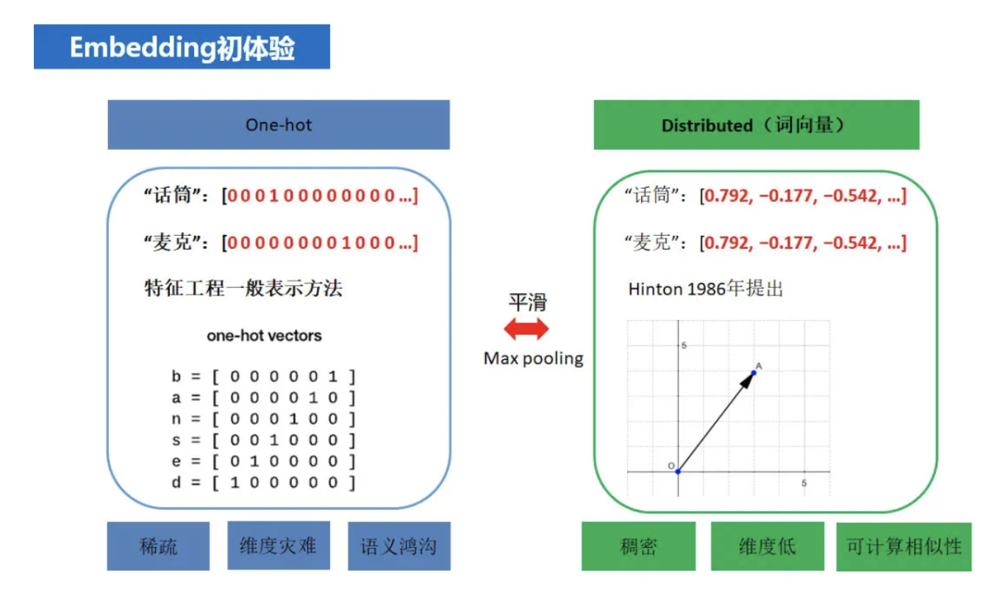
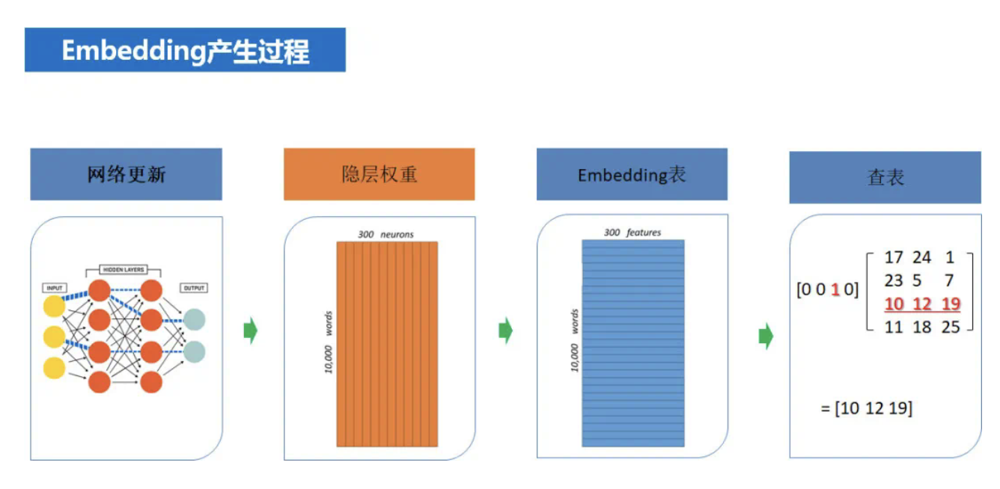
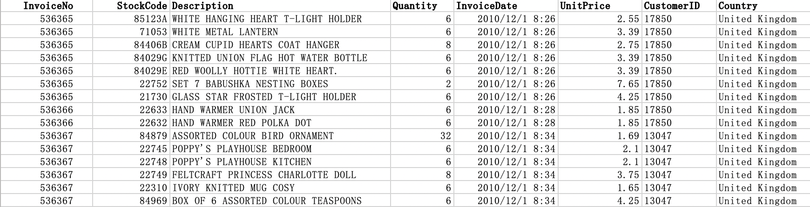

[TOC]

- [word2vec 基于内容相似的召回](#word2vec----------)
  * [前言](#--)
  * [Word2Vec 算法](#word2vec---)
    + [语言模型](#----)
    + [CBOW语言模型](#cbow----)
      - [hierarchical softmax](#hierarchical-softmax)
      - [negative sampling](#negative-sampling)
    + [one-hot 与word embedding的区别](#one-hot--word-embedding---)
  * [代码实现](#----)
      - [实验数据](#----)
      - [gensim](#gensim)
      - [实现思路](#----)

# word2vec 基于内容相似的召回

## 前言

上一个博客我们记录了协同过滤算法，利用用户或商品之间的相似性，进行商品的推荐。这种相似性更多表现在用户的行为上（例如用户看过这个电影，因此与这个电影发生关联）。

本文则是想通过对物品内容的理解，得出对物品内容的向量表达，然后计算向量之间的相似度从而得到相似的物品列表。这类方法较多用与基于文本内容的物品。

## Word2Vec 算法

word2Vec 最早由谷歌在2013年提出，是一个可以在百万数量级的词典上和上衣数量级的数据集上进行高效训练，得到的词向量可以很好的度量词与词之间的相似性。

### 语言模型

当我们在考虑处理文本数据的时候，我们需要为文本找到计算机能够计算的表达方式。例如在进行语言模型的训练中首先将单词转化为one-hot形式，然后作为模型的输入。

One-hot 优点是形式简单，计算方便。但是缺点也很明显。one-hot比较冗长（长度相当于词典的大小。），one-hot非常的系数，大部分都是0。因此我们希望能够得到一个更加精炼的词的表示形式即word embedding (词嵌入)。

常见的语言模型是对文本出现的概率进行估计。例如一个长度为T的字符串，所有的词的概率分布为p(x1,x2,x3...)，则这个字符串出现的概率为：
$$
p(s) = p(x1,x2,...,xn) = p(x1)*p(x2|x1)...*p(xn|x1,x2,...)
$$
常见的语言模型由CBOW和skip-Gram两种。其中CBOW利用上下文来预测当前词，skip-gram则是利用当前词来预测上下文。WordVec则是作为这些语言模型的输入。通过提升语言模型的预测精度，从而训练Word2vec，得到非常准确的词向量。

### CBOW语言模型

CBOW的输入是one-hot，输出是一个向量。模型的算是函数可以视为一种交叉熵。通过最小化交叉熵的方法，对模型参数进行更新。CBOW通过上下文来预测当前的词，他的网络结构如下：

其中输入为one-hot编码，输出为词典的长度，每一个位置表示该词出现的概率。

输入层到隐藏层的参数为V x N，由于输入是one-hot，因此只有一个位置参数被激活，这个参数即是词向量表示，也就是中间得到的隐层结果。

所以训练语言模型的中间产物是这个V x N的网络参数，我们通过这个转化矩阵，可以将任意一个词，由one-hot形式转化为词嵌入（word embedding）形式。

#### hierarchical softmax

用一颗二叉树来表示词汇表中的所有单词。每个叶子节点表示单词，从根到root表示这个单词的出现概率。用哈弗曼树做运算能够间复杂度降低到o(h)，其中h表示树的高度。

#### negative sampling 

每次迭代过程中有大量的输出向量需要更新，为了解决这个问题，negative sampling 提出了部分更新的方法。此外在训练的时候需要负样本。通过选择一种概率分布来选择得到的负样本。

### one-hot 与word embedding的区别

embedding 相当于对one-hot做了平滑，one-hot相当于对embedding做了max pooling。

embedding的产生过程如下：

各种embedding的前沿研究：https://www.jiqizhixin.com/articles/2020-06-30-11

## 代码实现

#### 实验数据

**数据来源kaggle数据集[kaggle Online Retail](https://archive.ics.uci.edu/ml/machine-learning-databases/00352/)的2010年到2011年英国某家网上零售商店的销售数据。一共有用户ID，购买日期，购买数量，商品单价等八个字段。共包含541909个记录。**

> InvoiceNo/发票号码：每笔交易分配唯一的6位数，需注意退货订单的代码以字母'c'开头。
> StockCode/库存编号：每个不同的产品分配唯一的5位整数。
> Description/产品信息：对每件产品的简略描述。
> Quantity/数量：每笔交易的每件产品的数量。
> InvoiceDate/发票日期和时间：每笔交易发生的日期和时间。
> UnitPrice/单价：单位产品价格。
> CustomerID/顾客编号：每个客户分配唯一的5位整数。
> Country/国家：每个客户所在国家/地区的名称。

#### gensim

Gensim是一款开源的第三方Python工具包，用于从原始的非结构化的文本中，无监督地学习到文本隐层的主题向量表达。它支持包括TF-IDF，LSA，LDA，和word2vec在内的多种主题模型算法，支持流式训练，并提供了诸如相似度计算，信息检索等一些常用任务的API接口。

#### 实现思路

代码部分其实比较简单，利用gensim训练好的现成的word2vec模型。将数据集处理成编号：描述。然后将编号输入model中得出最接近的推荐。

