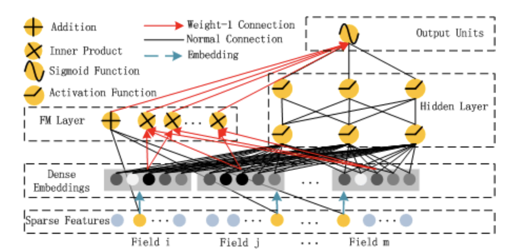
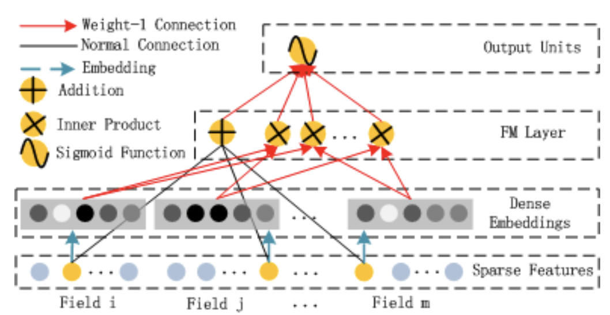
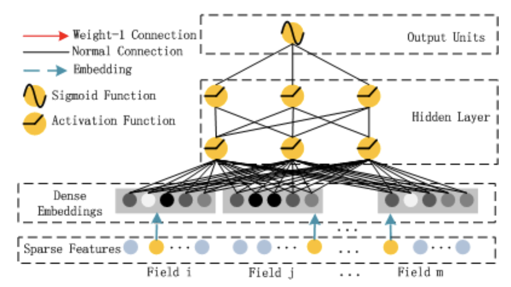
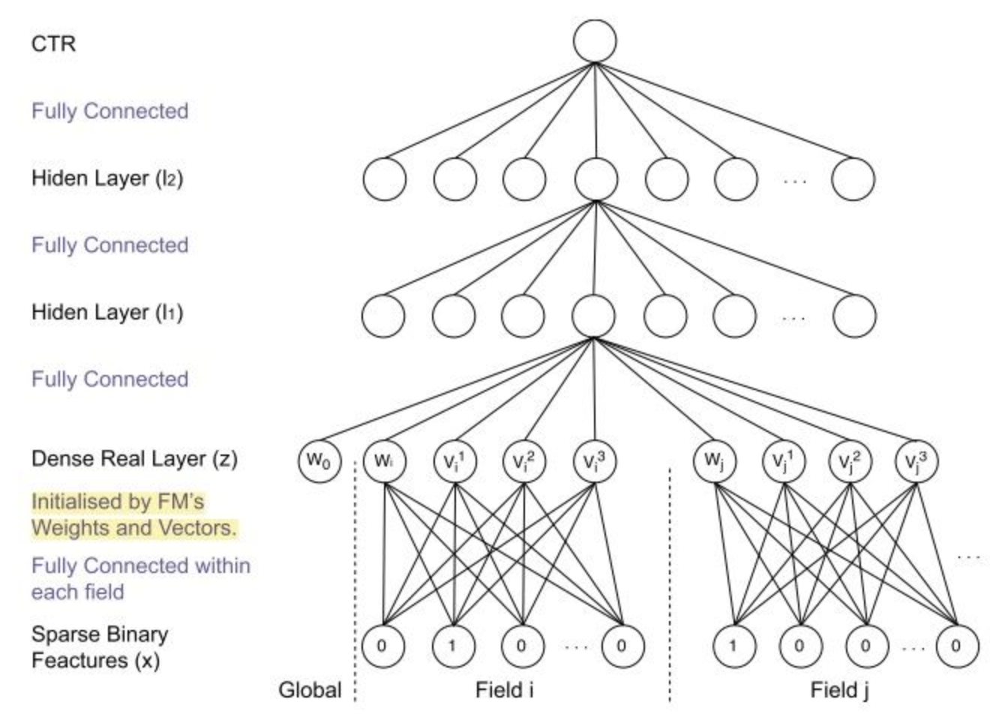
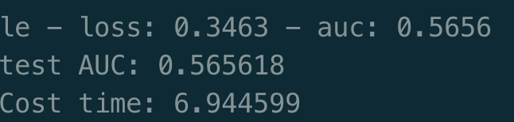

[TOC]

- [DeepFM模型](#deepfm--)
  * [DeepFM模型概述](#deepfm----)
    + [DeepFM数据输入](#deepfm----)
    + [DeepFM模型的特点](#deepfm-----)
  * [FM组件](#fm--)
    + [Deep组件](#deep--)
    + [模型对比](#----)
  * [代码实现](#----)
    + [数据准备](#----)
    + [代码思路](#----)
    + [实验结果](#----)

# DeepFM模型

DeepFM模型为华为诺亚方舟在wide and deep模型的基础上，进行优化改进得到。结合了wide and deep的优点，联合训练FM模型和DNN模型，实现了同时学习低阶特征交叉和高阶特征交叉的目标，其模型具有较好的记忆特性和泛化能力。

## DeepFM模型概述

DeepFM模型结构有两个组件组成，分别是deep部分和FM部分。如下图,FM和deep组件共享相同的输入，进行联合训练，联合函数为：
$$
\hat{y} = sigmoid(y_{FM} + y_{DNN})
$$
其中y取值为0或1，表示是否点击（ctr模型）。



### DeepFM数据输入

deepFM模型的输入为点击率预估中常见的(x,y)元组，其中x为一个多元组数据，有m个域的数据记录，其中包括了类别型字段和连续型字段，每个类别字段可以表示成一个onehot编码，x是十分稀疏且高维的。y则表示是否点击，取值为0或1。CTR预测任务就是构建一个模型 $ y = CTR\_Model(x)$ 来预测用户的点击概率。

### DeepFM模型的特点

- FM组件提取低阶模型交叉特征，deep组件提取高阶交叉特征，deepFM模型是端到端的，不需要人工特征工程
- 共享embedding层，免去了人工特征，使得训练更快更准确

## FM组件

FM组件是一个因式分解机，当数据是稀疏的时候，与之前的方法相比，他可以获得更加有效的2阶特征交叉，如下图，FM组件有一个求和单元和多个内积单元组成。他的表达式如下：
$$
y_{fm} = <w,x> + \sum_{j_1 = 1}^{d} \sum_{j_2 = j+1 + 1}^{d} <v_i,v_j>x_{j_1}x_{j_2}
$$
其中求和单元表示的是一阶特征，即图中第一层和第三层的连线，即参数为w的全连接层，得到的输出维度为field size。 其中内积则是反应了二阶的特征组合，最终会得到一个embedding size的输出。





### Deep组件

Deep组件是一个前馈神经网络结构，用于学习高阶特征交叉。由于ctr数据是高度稀疏的，类别和连续型混杂，因此需要在输入之前增加一个embedding层，用于减低维度。他的网络结构如下：



该网络结构有两个特性：

- 不同field输入向量的长度可以不同，但是输出的长度均为k。
- FM组件和deep组件共享embedding层，好处是没必要人工特征同时可以学到原始特征的低阶与高阶特征

### 模型对比

**FNN模型：**使用预训练的FM来初始化DNN的输入向量，FNN只有deep部分不能学习到低阶特征交叉。



**PNN：**为了捕获高阶特征，PNN在第一个隐层和embedding层之间增加一个交叉层（内积，外积等）他的主要缺点是，求内外积的复杂度高，且只能学到特征交叉，没有对低阶特征进行建模

**wide and deep：** 能够同时对低阶和高阶特征进行学习，但是wide部分还是需要大量的人工特征。

**deepFM优点**

- 没有使用FM来初始化DNN的输入
- FM和deep联合学习，得到端到端的结果
- 不需要特征工程
- 执行效率高


## 代码实现

### 数据准备

数据使用criteo数据集，其中连续数据：I1-I13进行归一化处理。离散数据C1-C26进行label encoder重新编码。

将数据分成train和test两部分，train和test由dense数据和sparse数据两部分数据组成：

```python
train_Y = [train[dense_features].values,
           train[sparse_features].values.astype(float32)]
```

并整理得到feature_columns：

```python
feature_columns = [
    [{'feat':'I1'},{'feat':'I2'} ... ]， # dense data
    [{'feat':'C1',feat_num:21,embed_dim:8},
    {'feat':'C2',feat_num:31,embed_dim:8}...] # sparse data
]
```

通过`train_test_split` 将数据集分成train和test两部分。最终返回feature_columns,train,test三个部分。其中feature_columns中包含了数据中每一列的处理方法。

### 代码思路

网络代码非常简单，有两部分组成，一部分是sparse数据，首先经过一层dense结构，输出sparse embedding，每一列均单独对应一个embedding：

```python
        self.embed_layers = {
            'embed_' + str(i): Embedding(
                input_dim = feat['feat_num'],
                input_length = 1,
                output_dim = feat['embed_dim'],
                embeddings_initializer = 'random_uniform',
                embeddings_regularizer = l2(embed_reg)
            ) for i ,feat in enumerate(self.sparse_feature_columns)
        }
```

每一个sparse数据经过自己单独的embedding层，然后再把sparse和dense组合起来：

```python
 sparse_embed = tf.concat([self.embed_layers['embed_{}'.format(i)](sparse_inputs[:,i]) for i in range(sparse_inputs.shape[1])],axis=-1)
 
 stack = tf.concat([dense_inputs,sparse_embed],axis=-1)
```

共享embedding层，将stack输入到FM中，做乘的平方，减平方的乘，最终输出(batch_size,1)：

```python
first_order = self.w0 + tf.matmul(inputs,self.w)
        # second_order
        second_order = 0.5 * tf.reduce_sum(
            tf.pow(tf.matmul(inputs,tf.transpose(self.V)),2) -
            tf.matmul(tf.pow(inputs,2) , tf.pow(tf.transpose(self.V), 2)),axis=1,keepdims=True)
```

另外一边是DNN结构，将向量输入到DNN结构中，DNN最终输出(batch_size,1)最终，将FM输出和DNN输出相加后经过sigmoid输出，去最小化交叉熵损失。

### 实验结果



