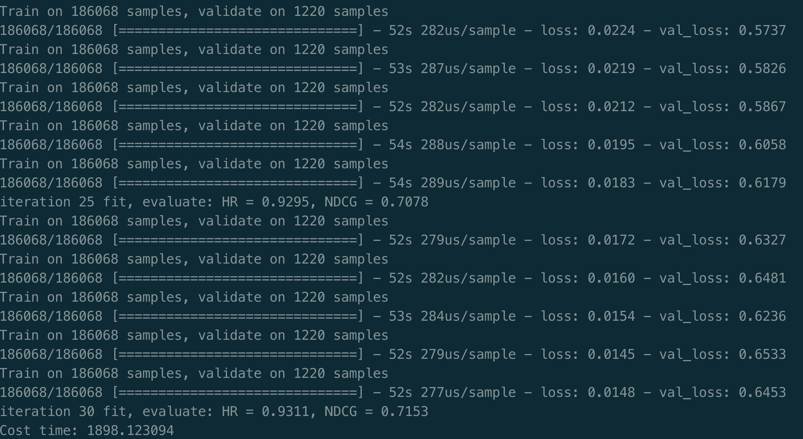

[TOC]

- [TensorFlow 2.0速记（DNN为例）](#tensorflow-20---dnn---)
  * [前言](#--)
  * [数据的读取](#-----)
  * [数据的预处理](#------)
  * [超参设置](#----)
  * [模型搭建](#----)
    + [使用sequence](#--sequence)
    + [模块化子类](#-----)
  * [优化器以及损失函数](#---------)
  * [度量方法](#----)
  * [训练过程](#----)
  * [模型的加载与保存](#--------)
  * [DNN训练movieLens数据集](#dnn--movielens---)
    + [DNN代码](#dnn--)
      - [评价指标：](#-----)
    + [实验结果](#----)
  * [使用anaconda 创建、安装tensorflow2.0 虚拟环境](#--anaconda------tensorflow20-----)
    + [conda 使用语法](#conda-----)
    + [安装步骤](#----)

# TensorFlow 2.0速记（DNN为例）

## 前言

借助《推荐系统算法实践》第11章的DNN算法实现，来记录一下tensorflow2.0在搭建网络，训练网络的过程中一些基本的要件是如何使用的。

## 数据的读取

**核心功能：对一个数据集，生成train_x,train_y,test_x,test_y，供下一阶段使用。**

当我们拿到一组新数据的时候，这些数据可能是用csv组成的大表的形式，或者用数据库存储，需要我们读取出来。总之先使用一个Python方法，对数据读取，组合，可能会涉及到pandas，或者是numpy这类的方法。

本文使用的数据集是movieLens，一个推荐系统和虚拟社区网站，其主要功能是利用协同过滤技术来对用户推荐喜爱的电影。movieLens数据集是电影评分的数据集合，大小从1M到20M。MovieLens Full（全部数据）含有来自270,000名用户对45,000部电影的26,0000,000条评分数据。本文使用较小的数据集，数据规模为：100,000 ratings and 3,600 tag applications applied to 9,000 movies by 600 users。

**数据的预处理过程就是将数据组合起来，然后生成LIST或者ARRAY，或者是DataFrame这三种。最后将划分好的训练集，测试集，验证集返回即可。**

```python
def _init_frame(self):
	data_df = pd.read_csv(root)
	...
	pad_sequences(...)
	# 可以做一些数据预处理的工作
	return (train_X,train_Y),(val_X,val_Y),(test_X,test_Y)
```

## 数据的预处理


## 超参设置

使用argparse模型，可以使用默认值，或者使用外部传入的参数--nums这样：


## 模型搭建

tensorflow2.0 搭建网络的时候，有两种模式：

### 使用sequence

使用sequential将网络层连接。

```python
model = tf.keras.models.Sequential([
  tf.keras.layers.Flatten(input_shape=(28, 28)),
  tf.keras.layers.Dense(128, activation='relu'),
  tf.keras.layers.Dropout(0.2),
  tf.keras.layers.Dense(10, activation='softmax')
])
```

### 模块化子类

第二种继承`tf.keras.Model`，实现其抽象方法`call()`,`__init__()`

```python
class MyModel(Model):
  def __init__(self):
    super(MyModel, self).__init__()
    self.conv1 = Conv2D(32, 3, activation='relu')
    self.flatten = Flatten()
    self.d1 = Dense(128, activation='relu')
    self.d2 = Dense(10, activation='softmax')

  def call(self, x):
    x = self.conv1(x)
    x = self.flatten(x)
    x = self.d1(x)
    return self.d2(x)
model = MyModel()
```

## 优化器以及损失函数

优化器，损失函数在compile中加入到模型的训练中。

## 度量方法

度量方法可以自己写，然后通过计算`model.predict` 和最终结果的区别来得到，或者在compile的时候作为参数传进去。

## 训练过程

模型搭建好之后，使用`model.compile`，`model.fit`，`model.evaluate` 进行模型的训练，测试过程。

```python
model.compile(optimizer='adam',
              loss='sparse_categorical_crossentropy',
              metrics=['accuracy'])
              
model.fit(x_train, y_train, epochs=5)

model.evaluate(x_test,  y_test, verbose=2)
```

## 模型的加载与保存

```python
# Calling `save('my_model')` creates a SavedModel folder `my_model`.
model.save("my_model")

# It can be used to reconstruct the model identically.
reconstructed_model = keras.models.load_model("my_model")
```

`tf.keras.callbacks.ModelCheckpoint`允许在训练的*过程中*和*结束时*回调保存的模型。

```python
# 在文件名中包含 epoch (使用 `str.format`)
checkpoint_path = "training_2/cp-{epoch:04d}.ckpt"
checkpoint_dir = os.path.dirname(checkpoint_path)
# 创建一个回调，每 5 个 epochs 保存模型的权重
cp_callback = tf.keras.callbacks.ModelCheckpoint(
    filepath=checkpoint_path, 
    verbose=1, 
    save_weights_only=True,
    period=5)
# 创建一个新的模型实例
model = create_model()
# 使用 `checkpoint_path` 格式保存权重
model.save_weights(checkpoint_path.format(epoch=0))
# 使用新的回调训练模型
model.fit(train_images, 
          train_labels,
          epochs=50, 
          callbacks=[cp_callback],
          validation_data=(test_images,test_labels),
          verbose=0)
```


## DNN训练movieLens数据集

### DNN代码

通过处理movieLens数据集，使得一个user对应一个观看电影的序列，同时随机生成负样本，同个user对应着一个观看电影的负样本序列。

然后通过padding使得数据的长度一致，输入embedding层生成稠密的embedding，最后输入DNN中参与计算，最后通过sigmoid输出，并最小话交叉熵损失。

#### 评价指标：

**HR：**命中率，即推荐列表中是否存在用户点击过的物品。
$$
HR = \frac{1}{N} \sum^{N}_{i=1}hits(i)
$$
N表示用户的总数，hits(i)表示第i个用户访问过得物品是否在列表中。是则为1。

**NDGC：**归一化折损累计增益，更加注重推荐的物品的排序先后，表达式如下：
$$
NDGC = \frac{1}{N}\sum^{N}_{i=1}\frac{1}{\log_2(p_i + 1)}
$$
N表示用户总数，$p_i$ 则是第i个用户真实访问值在推荐列表中的位置。若不存在，则为无穷大。

**MRR：**平均倒数排名，即更加强调物品的顺序：
$$
MRR = \frac{1}{N} \sum^{N}_{i=1} \frac{1}{p_i}
$$
其中N表示用户的总数，p表示用户正式访问物品在推荐列表中的位置。不存在则无穷。

### 实验结果




## 使用anaconda 创建、安装tensorflow2.0 虚拟环境

### conda 使用语法

- 创建环境：conda create –name <env_name> <package_names>
- 激活环境：source activate <env_name>
- 退出环境：deactivate
- 删除环境：conda remove –name <env_name> –all
- 环境列表：conda env list; conda info -e

### 安装步骤

1. 创建独立环境并激活

```
conda create --name tensorflow2.0 python==3.7
conda activate ~/anaconda3/envs/tensorflow2.0/
```

2. 安装TensorFlow2.0
   pip install tensorflow==2.0.0-beta -i https://pypi.tuna.tsinghua.edu.cn/simple

### conda 配置cuda环境

由于有时候主机的cuda和自己的tensorflow版本不同的问题，导致tensorflow无法使用。这时候，可以用conda创建虚拟环境：

```
conda create -name Zhou python=python3.6
conda install cudatoolkit=8.0
conda install cudnn=6.0
```

然后去找合适和TensorFlow版本：

```shell
anaconda search -t conda tensorflow 
# 找到合适的名字tmp之后
anaconda show tmp
# 找到具体的安装版本链接 link
conda install link
```

