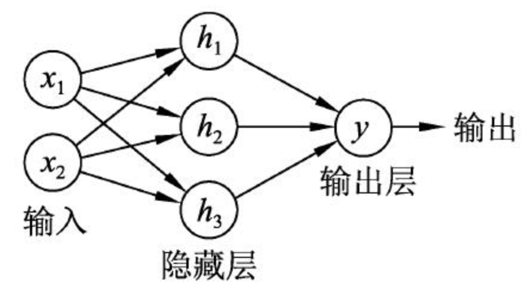
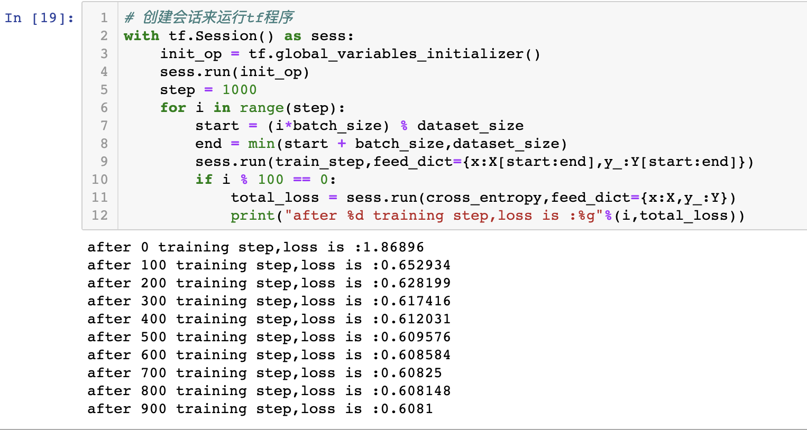

[TOC]

# tensorflow 入门

本篇将介绍tensorflow的**计算模型**， **数据模型** ， **运行模型**， 以及神经网络的**主要计算流程**。

## 计算模型--计算图

tensorflow 从名字上看，tensor可以被理解成一个多维的数组，flow就是数据的流动。TensorFlow就是一个通过**计算图**形式来表述计算过程的编程系统。每一个计算都是计算图上的一个节点，边则表明了计算之间的关系。

### 计算图的使用

tensorflow程序一般可以分为两个阶段，第一个阶段需要定义计算图中所有的计算。第二个阶段为执行阶段。

```python
import tensorflow as tf
a = tf.constant([1.0,2.0],name="a")
b = tf.constant([2.0,3.0],name='b')
result = a + b
```

在这个过程中，系统会自动维持一个默认的计算图，通过`tf.get_default_graph`函数可以获取当前默认的计算图：

```python
# 向量通过a.graph可以取得所属的计算图
print(a.graph is tf.get_default_graph())
```

除此之外，tensorflow还可以自己定义计算图：`g1 = tf.Graph()`，不同计算图上的张量和运算都不会共享：

```python
g1 = tf.Graph()
with g1.as_default():
    v = tf.get_variable("v",shape=[1],initializer=tf.zeros_initializer)
```

计算图还提供了管理张量和计算的机制，可以通过`tf.Graph.device('/gpu:0')` 来指定计算运行的设备。

在一个计算图中，可以通过集合来管理不同类别的资源，具体的方法是：

```python
tf.add_to_collection() # 将资源加入到集合中
tf.get_collection() # 取出一个集合中的所有资源
```

综上，tensorflow会默认生成一个计算图，然后在这个计算图上生成计算节点，完成第一步计算图的构建。

## 数据模型--张量

在tensorflow中所有的数据都是通过张量的形式来表示的，从功能上看，张量就是一个多维的数组。

**tensorflow实现张量并不是直接采用数组的形式，而是对运算结果的引用。他保存的是如何得到这些数字的运算过程。**

```python
import tensorflow as tf
a = tf.constant([1.0,2.0],name="a")
b = tf.constant([2.0,3.0],name='b')
result = tf.add(a,b,name='add')
print(result)

# Tensor('add:0',shape(2,),dtype=float32)
```

从上面过程中可以看出来，tensor保存的不是一个数字，而是一个结构：名称（name），维度（shape），类型（type）。

张量的第一个属性name，是张量的唯一表示，也给出了张量是如何得到的，name命名规则是：node:src_output，node表示运算类型，src_output表示该类型的第几个输出。`add:0`表示add的第一个输出。

tensor在进行计算的时候，会检查张量的类型，如果类型不匹配的话则会报错。例如将int32 + float32将会报错，因此我们在创建变量或常量的时候，通常会指定类型而不是使用默认的类型。

```python
a = tf.constant([1,2],name='a',dtype=tf.float32)
```

注意到创建一个常量的时候，还有一个参数是name，和上呼应，tensor中存储的是三个属性，其中name即由该参数传入。a这个tensor保存着结果的应用。

### 张量的使用

张量有两大用途，第一个是对中间结果的引用。例如要计算两个constant相加，就可以用张量来表示这两个constant（中间结果），然后两个张量相加。

第二个用途是根据张量来获取计算结果。这种情况是当计算图构建完成，启用会话之后，可以通过会话计算得到当前tensor中所保存的值：`tf.Session().run(a)`。

## 运行模型-- 会话

tensorflow程序在执行的时候，需要大量的系统资源。会话（session）机制管理着程序运行时的所有资源，当所有计算完成之后需要关闭会话来回收资源。可以将会话看成是一个上下文环境，当我们要执行代码的时候，需要在指定的会话里头进行。

开启会话的方式：

```python
# 法1，自己开启，自己关闭
sess = tf.Session()
...
sess.run(...)
sess.close()

#法2，使用with上下文管理器
with tf.Session() as sess:
  ...
  sess.run()
```

tensorlfow会自动生成计算图，所有的运算会自动加入到这个图中。会话也类似，但是tensorflow不会默认生成会话，需要手动指定：

```python
sess = tf.Session()
with sess.as_default():
  result.eval()
```

有点像是切入到具体的运行环境，如果没有默认的就需要自己确定使用哪个session进行运算，如果有默认的，直接对tensor取eval()函数，即可得到张量的取值。系统使用默认的session对他进行计算。

因此张量有两种取值方式，一种是在with下的session中，用`sess.run()` 的方式，另一种是指定默认的session，用`tensor.eval()`的方式。

交互式session，系统会指定默认的session，使用一些交互式场景如jupyter：

```python
sess = tf.InteractiveSession()
print(result.eval())
```


## Tensorflow 计算过程--实现神经网络为例

在确定一个神经网络的训练过程中，执行的步骤如下：

1. 确定输入的输入，将原始问题抽象成数据表达（特征提取）
2. 定义网络的结构
3. 通过训练数据来优化网络参数
4. 使用优化后的网络来预测数据

### 前向传播过程

搭建网络的时候，通过确定每一层有多少神经元，神经网络共有多少层来确定。一个最简单的方式，就是通过定义参数的形式来确定网络的结构:



如上图，输入层到隐层之间的参数为一个[2,3]的矩阵，隐层到输出层之间的参数为[3,1]的矩阵，简单定义如下：

```python
w1 = tf.Variable(tf.random_normal((2,3),stddev=1,seed=1))
w2 = tf.Variable(tf.random_normal((3,1),stddev=1,seed=1))
```

因此正向传播的过程如下：

```python
h = tf.matmul(x,w1)
y = tf.matmul(h,w2)
```

即用tensorflow中矩阵相乘的方式计算参数与输入之间的乘积，最后得到输出。

### 神经网络的参数与tensorflow变量

神经网络训练的目的就是不断优化其中的网络参数，网络参数通常有`tf.Variable`来定义得到，如上w1,w2。

**定义及初始化**

和其他语言类似，我们在定义变量的时候，也需要对他赋予初始值，使用随机值赋值时最常见的：

```python
weights = tf.Variable(tf.random_normal([2,3],stddev=2))
```

上面例子中使用`tf.random_normal`来初始化，会产生一个[2,3]的矩阵，满足正态分布，并且标准差为2,此外tensorflow还支持多种随机数生成的方式。

tensorflow还支持用常数来初始化变量：

```python
tf.zeros([2,3],tf.int32)
tf.ones([2,3],tf.int32)
tf.fill([2,3],9)
tf.constant([1,2,3])
```

偏置项通常使用常数来初始化。

也可用其他变量的值来初始化变量：

```python
w3 = tf.Variable(weights.initialized_value())
```

在执行程序之前，我们需要对变量进行初始化，在tensorflow中这一过程需要被显式的调用：

```python
init_op = tf.global_variables_initializer()
sess.run(init_op)
```

通过上述代码可以完成所有变量的初始化。

### 变量的组织与管理

变量是一个申明函数`tf.Variable`的一个运算，这个运算的结果就是张量。对于每一个Variable 来说，它都提供了两个方法：

- 一个方法是read：将实际值提供给这个变量参与的运算，例如`tf.matmul`。
- 第二个方法是assign：完成变量的初始化。

tensorflow通过集合来管理变量。所有的变量都会被自动的加入到`GraphKeys.VARIABLES` 这个集合中，通过`tf.global_variables()` 函数可以拿到当前计算图上的所有变量。

对于需要优化的变量，定义的时候默认参数 `trainable = true`，那么这个变量将会被加入到`GraphKeys.TRAINABLE_VARIABLES`集合中，这个集合也是tensorflow默认的优化对象集合，通过`tf.trainable_variable()`可以查看所有可训练的参数。

**variable与张量类似，有着name,shape,dtype三种类型的属性，可以通过定义这些属性得到适合的变量。在传参的时候，指定初始化值的shape是必须的，type则是自动匹配的，name不传入参数的话也是自动匹配的。**

### placeholder的作用

训练神经网络的过程是将数据分成一个个batch，然后循环，重复训练很多遍得到的。如果将每一次的数据都以一个变量的方式加到计算图中，那么这个计算图将不断的膨胀，变得非常大。因此一个解决方法是利用`placeholder`，为变量在计算图中留出位置，然后每次训练的时候重复使用这个空位置，并使用`feed_dict={x:value}`来指定传入的placeholder位置以及数据。

```python
x = tf.placeholder(tf.float32,shape=(None,2),name = "input")
```

可以看出来，`placeholder`也是有这三个主要的参数组成，其中shape的数据维度可以根据输入数据进行推测，可以不用写，但是如果确定传入的维度，写出来比较不容易出错。

`shape = (None,2)` 可以看出来，第一维参数是需要推测的，通常是batch的维度，用None表示的优点是，我们可以随意的设置batch而不使维度不匹配。

#### tensorflow计算过程的代码实现

一个简单的神经网络通常包含：

1. 数据的输入（特征工程）
2. 网络的搭建（网络层，参数的定义）
3. 前向传播过程
4. 执行过程（启用session）
5. 损失的定义（输出与GT之间的距离）
6. 优化器的定义（减小损失）
7. 训练过程（将batch用feed_dict喂给网络）
8. 每个一段时间的输出（中间结果）
9. 模型的保存
10. 模型的预测

下面完成1-8点，最后两点留着补充。

#### 结果



代码：[代码地址](../Code/tensorflow/simple_DNN_3_2.ipynb)


