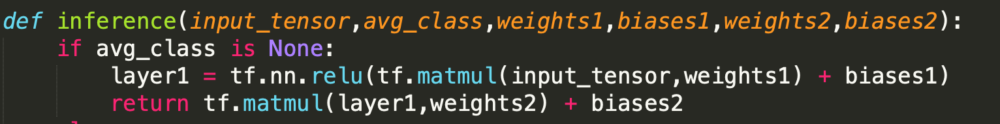
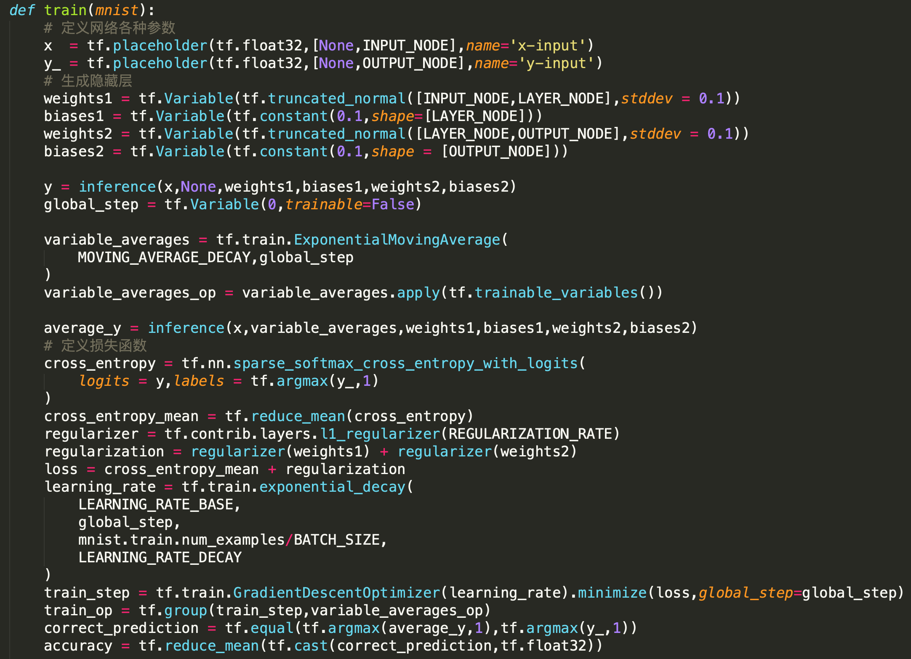
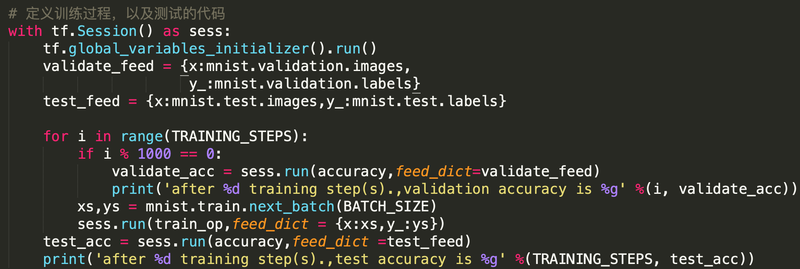
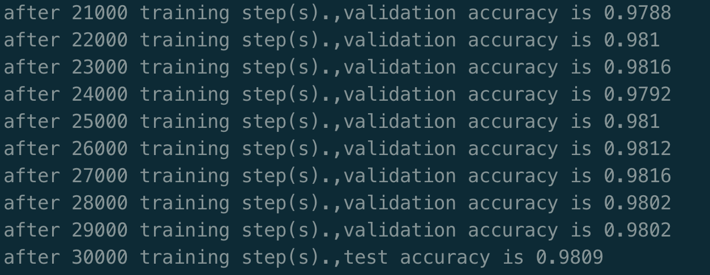
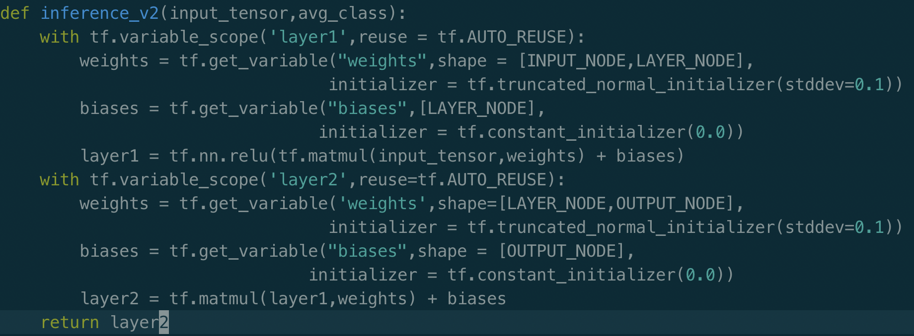

[TOC]

# mnist 数据识别问题

## 前言

下面将从mnist数字图像识别的例子中，简单地实现一个tensorflow代码。

## mnist 数据处理

tensorflow中提供了mnist的数据集，我们可以通过下面的方式直接得到：

```python
from tensorflow.examples.tutorials.mnist import input_data
# 如何./data中没有数据的话，这个函数就回去下载这个数据集
mnist = input_data.read_data_sets('./data/',one_hot)
# 随后便可以得到三个数据集
print(mnist.train.num_examples)
print(mnist.validation.num_examples)
print(mnist.test.num_examples)
print(mnist.train.labels[0]) # onehot的形式
```

为了方便训练，mnist还提供了next_batch函数：

```python
batch_size = 100
xs,ys = mnist.train.next_batch(batch_size)
```

### tensorflow 实现mnist初版

代码位置：[地址](../Code/5_1.py)

**代码解释：**



展示了模型的网络结构，即一层全连接层，激活函数为relu，随后又接一层全连接层。





上述过程定义了网络训练的参数，以及网络的损失函数，网络选择的优化器。预测结果，模型的训练过程。

**代码结果：**




## 变量管理

如上述代码过程，可以看出来，inference函数：

```python
def inference(input_tensor,avg_class,weights1,biases1,weights2,biases2)
```

在调用这个函数完成网络的构建以及数据的前向传播的过程中，我们需要将网络蕴含的所有参数都传进去，如果网络结构复杂，那么将难以处理网络的前向传播过程。

tensorflow解决这个问题的办法是提供了通过变量名称来创建或者获取一个变量的机制。主要实现方法是通过：`tf.Variable` 和 `tf.get_variable` 这两种方式。

#### 创建变量

```python
v = tf.Variable(name = "v", shape=[1],initializer = tf.constant_initializer(1.0))
v = tf.Variable(tf.constant(1.0,shape=[1]),name = 'v')
```

这两个函数在创建变量的时候，作用是完全一样的。

tf提供了7种初始化的方法：即随机random初始化参数，参数满足normal或uniform分布：

```python
tf.constant_initializer
tf.random_normal_initializer
tf.truncated_normal_initializer
tf.random_uniform_initializer
tf.zeros_initializer
tf.ones_initializer
```

`tf.Variable` 与 `tf.get_variable` 最大的不同在于get_variable中的参数名比必选的。同时`tf.get_variable` **会根据这个名字去创建或者获取变量。**

为了避免重用，tensorflow提供了`tf.variable_scope`这个方法，来指定变量的上下文：

```python
with tf.variable_scope('foo',reuse=True):
  v = tf.get_variable("v",shape = [1],initializer = tf.constant_initializer(1.0))
  # v 的名字为foo/v:0
```

注意，下次我们在foo这个上下文的时候，如果reuse设置为true，那么tf.get_variable就会去找这个变量，找不到则去创建他， 如果reuse设置为False，则会报错，因为已经存在这样一个变量了。

使用`tf.get_variable`的方式就可以在代码中任意位置调用，并训练参数，而不用将其视为参数传来传去。

改写inference代码如下：




### TensorFlow 模型持久化

tensorflow提供了一个非常简单的API来保存和还原一个神经网络模型，这个API是`tf.train.Saver`。 以下代码保存tensorflow计算图的方法：

```python
import tensorflow as tf
v1 = tf.Variable(tf.constant(1.0,shape=[1]),name = 'v1')
v2 = tf.Variable(tf.constant(2.0,shape=[1]),name = 'v2')
result = v1 + v2
init_op = tf.global_variables_initializer()
save = tf.train.Saver()

with tf.Session() as sess:
  sess.run(init_op)
  saver.save(sess,"model.ckpt")
```

模型保存后将会生成三个文件：

- model.ckpt.meta：里头保存着tensorflow计算图的结构
- model.ckpt：里头保存着tensorflow中每个变量的取值
- ckeckpoint：里头保存着一个目录下所有的模型文件列表

以下代码给出加载已保存的模型的方法：

```python
import tensorflow as tf

v1 = tf.Variable(tf.constant(1.0,shape = [1]),name = 'v1')
v2 = tf.Variable(tf.constant(2.0,shape = [1]),name = 'v2')
saver = tf.train.Saver()
with tf.Session() as sess:
  saver.restore(sess,"model.ckpt")
  print(sess.run(result))
```

如果不希望重复计算图上的运算，可以直接加载计算图的结构：

```python
saver = tf.train.import_meta_graph("path/model.ckpt.meta")
with tf.Session() as tf:
  saver.restore(sess,'model.ckpt')
  print(sess.run(tf.get_default_graph().get_tensor_by_name('add:0')))
```

书中还有多种模型参数的保存方法，包括仅保存部分的参数，仅载入部分的网络结构等。


