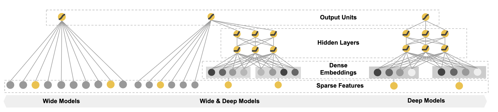

[TOC]

# wide and deep 模型

在深度模型出现之前，工业界基于GBDT和LR模型做出了非常多的特征工程工作，挖掘了非常多的有效特征。google提出的wide and deep模型：提出采用深度学习来解决非线性部分，沿用之前的工作来解决线性部分，取得了较好的效果。

## 推荐系统遇到的挑战

对于给用户推荐的商品来说，我们希望要同时具备记忆和泛化性。利用记忆，从用户的历史数据中发掘相关性，使得推荐的商品具有个性化的特点，显得更加的局部化。泛化性指的是特征将基于相关性发生转移，交叉出之前没有出现过的特征，探索用户之前没有点击过的商品。

**记忆：** 我们在使用离散数据的时候，通常将其转化为onehot的形式，通过 **稀疏特征交叉转换** 可以有效地达到记忆。类似于两个向量取AND操作，当同一个位置上都为1的时候，交叉转换的结果为1。例如用户同时安装了netflix，且点击了music。这样可以体出现一个特征对的共现率与目标间的相关性。（汉堡、薯条，通过交叉转换建立两者的关系）但是稀疏特征交叉转换的问题是，不具有泛化性，只能表示已出现过的东西。

**泛化性：** 例如FM等一些embedding，将query学到一个低维的稠密embedding向量，就可以泛化到之前未见过的query-item对，例如（query：汉堡，item：可乐），可以学到这种相关性。当时当地层的query-item对过于稀疏的时候，FM难以有效的对特征进行交叉， 因此学习到的稠密embedding可能会生成不相关的预测。因此embedding具有强泛化性，但是在稀疏特征上会失效。

## Wide AND Deep

google提出的wide and deep模型同时兼顾了两者：

**wide：** 宽线性模型用于记忆，从历史数据中发现item与或特征之间的相关性。输入的数据可以是大量的特征交叉转换后的向量。但是要达到泛化能力，需要更多的特征工程。

**deep：** 深度网络用于泛化，通过生成稠密embedding，可以更好的泛化样本中未曾出现过的特征。

### Wide 模型

wide模型主要为了学习已有特征的相关性，他是一个简单地广义线性模型：
$$
y = w^{T}x + b
$$
wide 的输入特征包括原始的特征以及转化后的特征，一个最重要的转化就是 **特征交叉转换**（即同时出现为1，表明两个特征的共现性），可以表示成：

wide输入：onehot离散特征 + onehot交叉特征（可以有多个交叉，col1 and col2 and col3...）

### Deep 模型

Deep模型可以被理解为相关性的传递，deep模型是一个前馈神经网络，例如FM和DNN等，输入一些稀疏，高维度的特征，将这些特征转化为低维度的稠密embedding。如果稀疏特征维度非常大的话，那么生成的embedding很难充分交叉特征，因此导致推荐不相关的物品。这一特征刚好与LR相互弥补。LR只能通过特征交叉组合来记住用户的喜好。

Deep输入：离散特征生成的稠密embedding，加上归一化之后的连续特征。

### 模型联合训练

我们将wide 和 deep模型的输入结合起来，共同输入到一个sigmoid函数中，得到最终的输出。联合训练和集成训练不同，集成训练是独立的，有多个分类器独立工作，最终结果投票得出。联合训练则是同一个loss，更新各自的参数，起到相互补充，相互影响的作用。
$$
P(Y=1 \mid \mathbf{x})=\sigma\left(\mathbf{w}_{w i d e}^{T}[\mathbf{x}, \phi(\mathbf{x})]+\mathbf{w}_{d e e p}^{T} a^{\left(l_{f}\right)}+b\right)
$$

## Wide and Deep 系统实现

### 推荐过程

### 代码实现

