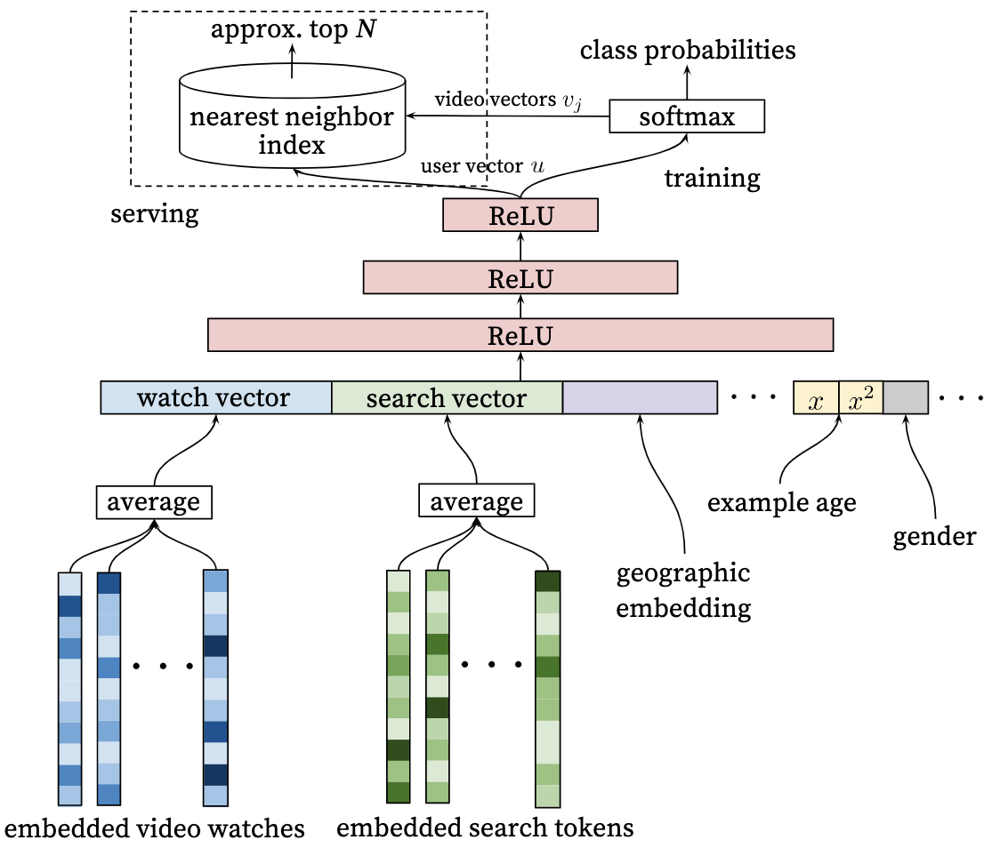
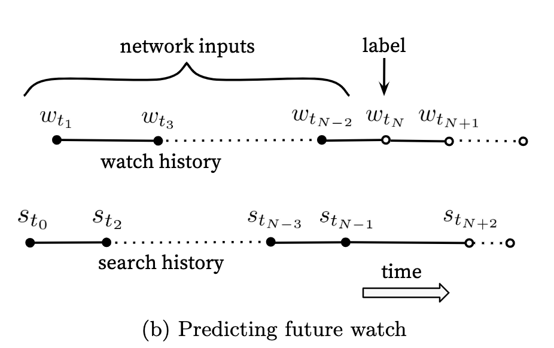
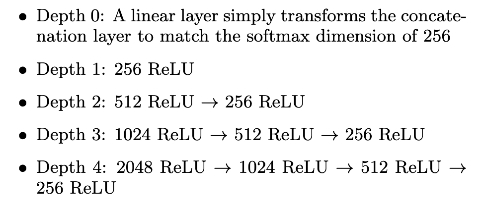
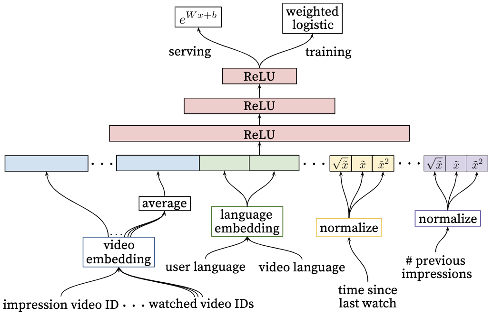
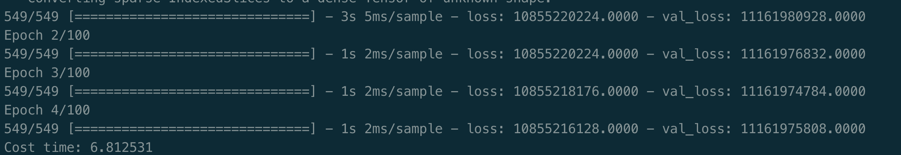
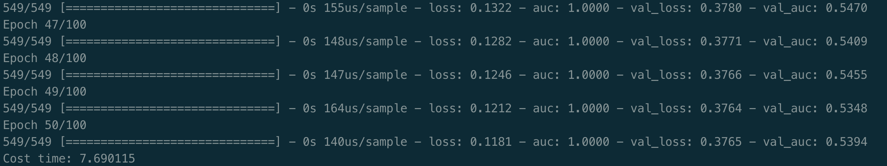

[TOC]

- [YouTube推荐系统](#youtube----)
  * [背景](#--)
  * [召回模型设计](#------)
    + [召回模型设计](#-------1)
      - [输入层](#---)
      - [中间层](#---)
      - [输出层](#---)
      - [线上server部分](#--server--)
      - [损失函数部分](#------)
    + [召回特征和样本的设计](#----------)
    + [softmax多分类问题如何通过负采样变成二分类问题](#softmax-------------------)
    + [softmax的negative sample问题和NCE问题](#softmax-negative-sample---nce--)
  * [排序模型设计](#------)
    + [输入层](#----1)
    + [中间层](#----1)
    + [输出层](#----1)
    + [损失函数部分](#-------1)
  * [十个深入的问题](#-------)
  * [YouTube 排序模型server部分](#youtube-----server--)
  * [代码实现](#----)
    + [召回模型](#----)
      - [数据准备](#----)
      - [召回代码思路](#------)
      - [遇到的问题](#-----)
      - [代码结果](#----)

# YouTube推荐系统

（这是个大工程，希望吃透他）

## 背景

YouTube推荐系统完成了工业级的视频推荐，主要分为候选视频的召回模型，和线上的排序模型。并在实现角度上，对特征的处理，模型的训练，调优都做了详细的介绍。

YouTube视频推荐主要棉铃的挑战：

- 规模：YouTube有着庞大的用户群和语料库，因此需要采用大规模的分布式学习算法
- 新鲜度：YouTube上每天都有很多新的视频上传，需要及时响应新的视频和用户的新行为
- 噪声：由于数据稀疏且不可观察等多种因素，不易直接从用户历史记录中获取真实的用户满意度，获得的更多的是隐式的噪声信号

YouTube推荐系统结构如下：

- 召回模型：从用户的视频预料中，检索出一小部分视频（数百个），这些候选集时域用户行为高度相关的。这里主要通过协同过滤实现比较泛化的检索，例如使用视频ID列表，搜索token，人口统计信息等
- 精排模型：引入更多的数据，使用较为重的模型，对候选视频进行精排
- 评估方法：离线评估方法包括precision，recall，ranking loss等，最终效果需要在线上进行A/B test 测试，其中关注的指标包括点击率和观看时长。

## 召回模型设计

### 召回模型设计

为了生成候选集，需要从视频语料库中挑选出于用户相关的视频。YouTube解决这个问题的做法是将这个问题视为用户的**next watch问题**，模型通过softmax输出，输出是一个在所有candidate video上的一个概率分布，是一个超多分类问题（分类规模为百万级别）。

我们从下往上看：

#### 输入层

输入特征包括用户历史观看的视频序列embedding，搜索序列token的embedding，用户的地理位置的embedding，年龄，性别等。然后把所有这些特征concat起来，传给上层的ReLU神经网络。

- 对于用户观看视频序列，或是搜索序列，我们可以简单实用视频ID进行embedding，然后累加并计算平均值。
- 用户地理特征和设备特征：均为离散的特征，采用onehot或者embedding处理
- 人口属性：可以进行归一化处理。其中人口统计特征可以提供丰富的先验信息，可以实现较好的新用户推荐效果

#### 中间层

中间层包括两层，每一层都是一个ReLU的激活函数。

#### 输出层

输出层的维度和视频ID的embedding维度一致，最终输出用户vector U。然后借助这个U去预测下一个推荐的视频。输入softmax中，得到百万个candidate的概率，然后通过梯度反向传播，提升模型的准确性。

#### 线上server部分

通过上述模型，我们可以得到所有的视频embedding（由视频ID生成的）N x K，以及所有用户的embedding 表示 M x K。其中K表示embedding的大小。最后在所有视频中寻找与用户u最近邻的topN。

#### 损失函数部分

网络使用softmax进行多分类，得到每一个类别的概率之后做交叉熵损失。softmax表示如下：
$$
P\left(w_{t}=i \mid U, C\right)=\frac{e^{v_{i} u}}{\sum_{j \in V} e^{v_{j} u}}
$$
其中u表示生成的用户embedding，$v_ju$ 表示第j个视频的embedding。

模型的目的是预测下一个video，由于存在百万个video，就存在百万个类别，直接训练这样的分类问题及其的困难，因此作者采用负类采样的方式（sample negative classes），采集数千个负类，将多分类问题变成二元分类问题，极大地提升了效率。

### 召回特征和样本的设计

这部分类似于特征工程，介绍该工作在输入样本上的处理。

- 异构信息处理

  - 视频ID向量化：得到用户各种视频行为向量，例如用户曝光视频向量，观看视频向量，搜索视频向量等
  - 用户画像特征归一化处理：如地理特征、设备特征、年龄、性别，登陆状态等，归一化到0-1之间然后和用户视频向量进行concat
  - 视频生命周期（example age）：该特征表示视频上传之后的时间。进过观察，发现用户倾向于点击一些不那么相关的新视频。通过历史记录能以学到视频的流行度，因此需要将example age添加到DNN的输入向量中。在训练的时候，时间越新，该值越接近0，或一个绝对值小的负数。（在训练样本的时候，将example age作为一个特征值进行训练，在线上进行服务的时候，会将example age设置成0，表示最新状态。）

- 样本选择和上下文的选择

  - 样本选择：（1）选择用户全部观看记录，以及通过其他途径（其他网站）的观看记录做推荐。这样的好处是通过CF快速传播用户行为。（2）保证每个用户历史记录样本数量固定，避免有些用户过多，有些过少，影响模型的公平性。（3）对搜索样本进行无序化处理，如果推荐的结果使用用户最后一次的搜索，效果验证过比较糟糕，将搜索序列做无序化处理，效果更好。
  - 上下文选择：用户在观看视频的时候，通常会遵循一种非对称模式，一开始兴趣广泛，后来逐渐集中。通过观察发现，利用用户观看历史做推荐的时候，确定label之后，输入只是用label发生之前的上下文，能够避免label提前泄露的问题。

  

- 神经网络深度和参数的选择

  - 增加特征以及网络深度都有助于网络的准确率
  - 在该实验中，作者使用最多50个观看历史，和50个搜索历史。最终映射成256维的向量，最终通过softmax输出一个1 million的视频概率得分。模型基于所有用户进行训练。

  

### softmax多分类问题如何通过负采样变成二分类问题

当我们在计算softmax公式的时候：
$$
softmax = \frac{e^{w_tx+b}}{\sum^{V}_{i} e^{w_ix+b}}
$$
通常因为V的值过大（字典的长度），导致softmax过程非常的耗时。负采样的含义是，按照一定的概率，随机采样一些样本作为负类，将原来的V分类问题转化为K分类问题。

在YouTube这个问题中，作者采样了1000多类的样本，替换原来的上百万类。

### softmax的negative sample问题和NCE问题

在tensorflow中对多分类问题有两种处理方式，一种是`tf.sample_softmax`，另一种是`tf.nn_nce`。**这两种方式本质上都是降低在超大规模分类的时候，softmax计算量的问题。**negative sample的问题上一点已经讲过，即按照一定概率做负样本的采样。NCE则是softmax的一种近似实现算法。

NCE核心是将多分类问题转化为二分类，例如预测下一个视频，通过随机噪声采样，采集K个无关视频，加上label共k+1个，然后做Logit二分类，找出最可能是label的那个。通过这样的转换，NCE将原来的需要求和的分母，转化为待学习的变量，大大减小了计算成本。并且当K的值足够大的时候（大于25），从理论上NCE算法的结果非常接近softmax结果。

tensorflow在实现的时候，softmax是一个多分类问题，NCE则是由多个logit 的二分类分类器组成，在实际处理的时候，两者都可以使用（可能存在细微差别）。

- Negative sample：减小分母要累加的总量
- NCE：通过算法预测分母

## 排序模型设计

为了对每个视频进行评分，YouTube将这个问题转化成预测每个视频的预期观看时长。自然是时长越长越先推荐。排序的网络结构如下：

排序模型的主要目的是对召回模型召回的结果做进一步的排序，可以考虑加入更多的特征，如上图，其中impression video表示当前要评分的视频。

依旧从下往上看：

### 输入层

- impression video ID embedding：当前video的embedding
- watched video IDs：用户最后看过的N个视频的embedding
- language embedding：用户语言和当前语言的embedding
- time since last watch：自上次看过同个channel的时间（类似attention）
- previous impression：这个视频曝光给用户的次数（类似exploration，增加多样性）

### 中间层

排序模型和预测模型非常的类似，中间层是激活函数为ReLU的全连接层

### 输出层

网络的输出层为weighted logit regression，即加了权重的LR。但是模型的sever部分使用的是$e^{wx + b}$的形式。这里需要注重解释一下，对于一般的模型来说，server部分会原封不动的将输出层搬过来。因此我们需要理解为何YouTube这么做。

但我们先暂时放下这个问题，只讨论输出层的实现。输出层的目标是预测视频的预期观看时长，选定正负样本，利用观看时长对正样本进行加权。经过推导该问题的发生比等于用户的观看时长。因此利用观看时长对正样本进行加权，能够直接反应在发生比上。

通过最小化交叉熵损失，训练网络。在sever的时候，利用生成的W参数，使用指数形式表示预测时长。

### 损失函数部分

**模型训练部分的输出是一个二分类问题，即当前输入模型的video是否被点击**，对正样本进行weight观看时长的加权。然后server部分直接用指数函数对当前的样本进行一个评分。

损失函数使用weighted LR来训练，此处的weighted LR从训练方式可以看出来，重复采样weight次，或一次训练梯度乘以weight，直接反应在样本出现的次数上。

传统的weighted LR更多是面对样本不均衡的，和这里的weighted LR的表达式有差异。

例如我们优化一个二分类的交叉熵问题，有下面两种处理方法

1. weight表示重复采样weight次，然后相加。
2. 或者在计算梯度的时候，直接乘上weight，很明显，在计算梯度的时候只对参数进行求导，因此只要在参数的位置乘上权重即可。

$$
weighted LR = \frac{1}{1 + e^{-w\theta x+b}}
$$

可以写代码了。

## 十个深入的问题

1. 召回阶段如何解决softmax超多分类的问题？

   > 使用负样本采样，并使用important weighting方法对采样进行标定

2. 召回阶段在生成候选样本的时候为什么不通过模型训练得出候选集，而是去库中找到topN？

   > 这是一个工程的问题，如果用户发出一个请求就去inference一次整个数据集的话，速度太慢了。因此需要提前将视频的embedding保存在redis或内存中，然后通过最近邻找到topN。

3. YouTube在处理新视频的时候，如何加入新视频的bias？

   > 作者引入一个example time的变量，表示视频上传的时间，越是新的视频，这个值越接近0。然后在server的时候，将这个值置为0。

4. 召回阶段在对用户历史记录的处理过程中，对每个用户只提取了等量的数据，这是为什么？

   > 为了数据的公平性，避免活跃用户过度影响模型的效果

5. YouTube不采取时序模型，而是将历史浏览记录同等看待，不关注时序，为什么？

   > 这个是经验之谈，工程师发现，推荐结果需要考虑历史的浏览记录，过度考虑最近的搜索结果，效果通常比较差。

6. 在处理训练集的时候，YouTube不采用经典的留一法（从历史中随机选一个），而是用最新一次的点击作为next watch，为什么？

   > 原因是为了避免label泄露

7. 在确定优化目标的时候，YouTube不采用经典的CTR，而是使用视频播放时长，为什么？

   > 从模型的角度出发，watch time更能反映用户的真实兴趣，watch time越长YouTube赚钱也越多。从这个角度出发，利用时长作为预测目标比CTR有着更加直接的好处。

8. 在进行视频embedding的时候，为何直接将长尾的video embedding置为0？

   > 这是工程和算法的权衡，为了节约线上server的时间，此外长尾的视频通常点击概率低，过滤掉也有好处。

9. 针对一些特征，例如previous impression（曝光次数），为什么选择开方和平方处理之后再输入？

   > 增加特征的非线性，提升离线的准确率

10. 排序模型输出层为何采用weighted Logit regression？

    >  weighted目的是为了引入正样本的权重，在线上使用指数形式，可以完美的得到时长的近似。

## YouTube 排序模型server部分

之前提到了，YouTube server部分的结构和排序模型输出层的结构不同（不同惯例）。Server部分将W作为参数，使用一个指数函数作为视频预测时长的输出。而输出层使用的是weighted LR的输出作为next video的embedding。 

为何如此设计，这就要回溯到LR模型的根本问题上：
$$
LR = \frac{e^{wx+b}}{1 + e^{wx+b}}
$$
进一步我们引入发生比，即发生的概率比上未发生的概率：
$$
odds = \frac{p}{1-p}
$$
带入sigmoid表达式，取对数得到：
$$
\ln(odds) = ln(\frac{p}{1-p}) = b + w_1x
$$
这既是非常著名的logit函数。因此LR是个分类问题，但是可以非常巧妙的转变成回归的问题，就是因为有上面的推导。($b + w_1x$ 是一个完美的一次回归方程。)

回到我们的问题：
$$
odds = \frac{p}{1-p} = e^{wx + b}
$$
因此YouTube的输出其实是发生率。当时model的目标其实是预测模型发生的时长，怎么输出发生率呢？

我们从模型的输出层来看，是一个weighted LR结构，即输出为$ w_ip $ 。$w_i$ 表示观看时长，p表示视频点击概率，因此odds改写成：
$$
odds = \frac{w_ip}{1-w_ip}
$$
由于面对海量的视频，用户点击视频的概率非常低，因此分母无限接近0，所以：
$$
odds = w_ip
$$
即观看时长乘以点击概率，完美的预期观看时长。所以输出的 $odds = e^{wx+b}$ 其实是用户对x这个视频的预期观看时长。理论上，结构上都非常完美。

以上，解决了YouTube model的所有细节，下面实现一个建议的YouTube推荐版本。

## 代码实现

 ### 召回模型

#### 数据准备

使用MovieLens-1M数据集，数据格式如下：

| userId | MovieId | rating | timestamp |
| ------ | ------- | ------ | --------- |
| 1      | 1       | 4      | 964982703 |

使用数据：

userId1：{timestamp1:movie1,timestamp2:movie2 ...}

即用户观看历史，以及example age。

#### 召回代码思路

实现代码的方式是，将用户历史记录转化成embedding，然后结合rating，用户id，作为用户侧的数据。然后实现YouTube网络结构层，最后通过tf.nn.sampled_softmax_loss进行负样本采样。

#### 遇到的问题

由于数据格式比较复杂，因此在传入数据的时候，出现一些问题，下次做实验之前应该要先全面验证一下数据是否存在漏行啊等等问题。

自定义loss，使用compile传入，出现了很多问题，最终放弃，还是使用基础的softmax作为分类器。

#### 代码结果

### YouTube ranking部分

这一部分的网络结构与召回部分相似，最后加了个sigmoid结构。

很草草的写完了这一部分，意识到tensorflow2.0需要定制一些东西，实在比较麻烦。考虑到大家都在用1.x。写一次版本可能会用tensorflow1.x来写。我最好去买本书来看。

Ranking 部分最大的亮点是使用了weighted LR，将rating直接乘上输出值。