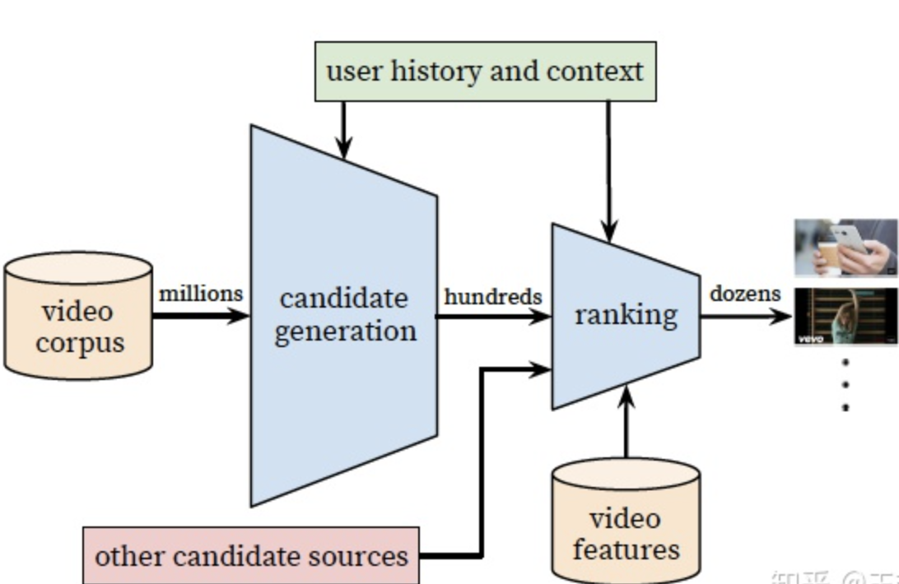

[TOC]

# YouTube推荐系统

（这是个大工程，希望吃透他）

## 背景

YouTube推荐系统完成了工业级的视频推荐，主要分为候选视频的召回模型，和线上的排序模型。并在实现角度上，对特征的处理，模型的训练，调优都做了详细的介绍。

YouTube视频推荐主要棉铃的挑战：

- 规模：YouTube有着庞大的用户群和语料库，因此需要采用大规模的分布式学习算法
- 新鲜度：YouTube上每天都有很多新的视频上传，需要及时响应新的视频和用户的新行为
- 噪声：由于数据稀疏且不可观察等多种因素，不易直接从用户历史记录中获取真实的用户满意度，获得的更多的是隐式的噪声信号

YouTube推荐系统结构如下：

- 召回模型：从用户的视频预料中，检索出一小部分视频（数百个），这些候选集时域用户行为高度相关的。这里主要通过协同过滤实现比较泛化的检索，例如使用视频ID列表，搜索token，人口统计信息等
- 精排模型：引入更多的数据，使用较为重的模型，对候选视频进行精排
- 评估方法：离线评估方法包括precision，recall，ranking loss等，最终效果需要在线上进行A/B test 测试，其中关注的指标包括点击率和观看时长。

## 召回模型设计

### 召回模型设计

为了生成候选集，需要从视频语料库中挑选出于用户相关的视频。YouTube解决这个问题的做法是将这个问题视为用户的**next watch问题**，模型通过softmax输出，输出是一个在所有candidate video上的一个概率分布，是一个超多分类问题（分类规模为百万级别）。

我们从下往上看：

#### 输入层

输入特征包括用户历史观看的视频序列embedding，搜索序列token的embedding，用户的地理位置的embedding，年龄，性别等。然后把所有这些特征concat起来，传给上层的ReLU神经网络。

- 对于用户观看视频序列，或是搜索序列，我们可以简单实用视频ID进行embedding，然后累加并计算平均值。
- 用户地理特征和设备特征：均为离散的特征，采用onehot或者embedding处理
- 人口属性：可以进行归一化处理。其中人口统计特征可以提供丰富的先验信息，可以实现较好的新用户推荐效果

#### 中间层

中间层包括两层，每一层都是一个ReLU的激活函数。

#### 输出层

输出层的维度和视频ID的embedding维度一致，最终输出用户vector U。然后借助这个U去预测下一个推荐的视频。输入softmax中，得到百万个candidate的概率，然后通过梯度反向传播，提升模型的准确性。

#### 线上server部分

通过上述模型，我们可以得到所有的视频embedding（由视频ID生成的）N x K，以及所有用户的embedding 表示 M x K。其中K表示embedding的大小。最后在所有视频中寻找与用户u最近邻的topN。

#### 损失函数部分

网络使用softmax进行多分类，得到每一个类别的概率之后做交叉熵损失。softmax表示如下：
$$
P\left(w_{t}=i \mid U, C\right)=\frac{e^{v_{i} u}}{\sum_{j \in V} e^{v_{j} u}}
$$
其中u表示生成的用户embedding，$v_ju$ 表示第j个视频的embedding。

由于存在百万个类别，直接训练这样的分类问题及其的困难，因此作者采用负类采样的方式（sample negative classes），采集数千个负类，将多分类问题变成二元分类问题，极大地提升了效率。

### 召回特征和样本的设计

这部分类似于特征工程，介绍该工作在输入样本上的处理。

- 异构信息处理

  - 视频ID向量化：得到用户各种视频行为向量，例如用户曝光视频向量，观看视频向量，搜索视频向量等
  - 用户画像特征归一化处理：如地理特征、设备特征、年龄、性别，登陆状态等，归一化到0-1之间然后和用户视频向量进行concat
  - 视频生命周期（example age）：该特征表示视频上传之后的时间。进过观察，发现用户倾向于点击一些不那么相关的新视频。通过历史记录能以学到视频的流行度，因此需要将example age添加到DNN的输入向量中。在训练的时候，时间越新，该值越接近0，或一个绝对值小的负数。（在训练样本的时候，将example age作为一个特征值进行训练，在线上进行服务的时候，会将example age设置成0，表示最新状态。）

- 样本选择和上下文的选择

  - 样本选择：（1）选择用户全部观看记录，以及通过其他途径（其他网站）的观看记录做推荐。这样的好处是通过CF快速传播用户行为。（2）保证每个用户历史记录样本数量固定，避免有些用户过多，有些过少，影响模型的公平性。（3）对搜索样本进行无序化处理，如果推荐的结果使用用户最后一次的搜索，效果验证过比较糟糕，将搜索序列做无序化处理，效果更好。
  - 上下文选择：用户在观看视频的时候，通常会遵循一种非对称模式，一开始兴趣广泛，后来逐渐集中。通过观察发现，利用用户观看历史做推荐的时候，确定label之后，输入只是用label发生之前的上下文，能够避免label提前泄露的问题。

  

- 神经网络深度和参数的选择

  - 增加特征以及网络深度都有助于网络的准确率
  - 在该实验中，作者使用最多50个观看历史，和50个搜索历史。最终映射成256维的向量，最终通过softmax输出一个1 million的视频概率得分。模型基于所有用户进行训练。

  

## 排序模型设计

