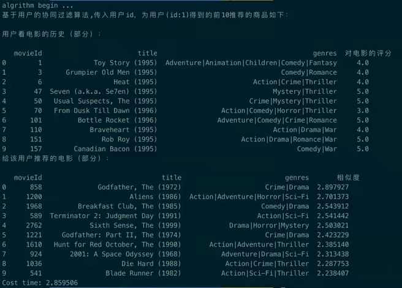
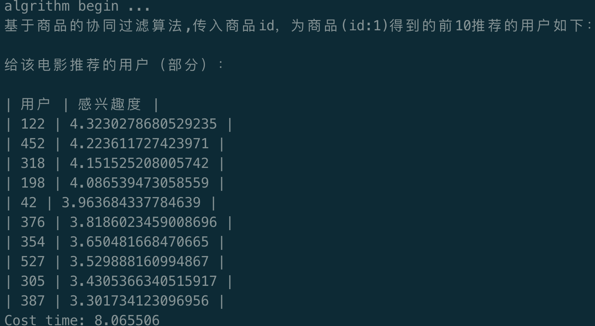

[TOC]

- [协同过滤算法](#------)
  * [推荐算法的演化](#-------)
  * [协同过滤算法](#-------1)
    + [相似度计算方法](#-------)
    + [推荐计算](#----)
  * [代码实现](#----)
    + [重要框架介绍](#------)
      - [Apache](#apache)
      - [spark](#spark)
      - [hadoop](#hadoop)
      - [hadoop和spark](#hadoop-spark)
    + [代码实现](#----)
      + [总结](#总结)

# 协同过滤算法

协同过滤算法是推荐中最早应用的，最古老的算法。从他晦涩的名字就可以看出来这个算法有着很深的数学内涵（自己胡扯），但是实际上他的做法却非常的简单。

## 推荐算法的演化

在具体到点之前，先看看整个面。推荐算法从90年代开始发展至今，已经成为了一个独立的学科。主要发展的历程为：

1. 1994年提出协同过滤算法，作为推荐系统Grouplens的主要推荐技术
2. 1995年提出个性化推荐
3. 1997年首次提到推荐系统（recommender system）
4. 1998年亚马逊上线了基于物品的协同过滤算法
5. 2003年，Google推出了adword的计价模式，即广告计价
6. 2006年netflix宣布一个推荐算法竞赛，极大地促进了推荐系统的发展
7. 2007年雅虎退出个性化横幅广告
8. 2007年第一个ACM推荐系统大会召开
9. 2015年Facebook在官网公布了推荐系统的原理及应用
10. 2016年YouTube，google发表论文说明推荐系统的应用

## 协同过滤算法

首先从名字出发，**协同：寻找相似性**，**过滤：利用相似性过滤掉一些无用的商品。**

算法的整体思路是：

1. 用户对物品发生的行为，例如点击，购买等等，通过对数据的加权、分组、减噪、归一化等等预处理过程，得到用户对物品的喜爱程度的一张大表
2. 相似度计算，用户相似性：用户对所有物品的偏好向量；物品相似性：所有用户对该物品的偏好向量
3. 相似度计算，通过一些准则（cos，欧氏距离，皮尔逊系数等），计算用户、物品的相似性。
4. 例如用户，找到与该用户向量最相似的top N，这个topN喜欢的物品就可以推荐给这个用户

**一句话概括：UserCF：利用用户对物品的偏好找到相似的用户，然后将相似用户喜欢的物品推荐给当前用户。（itemCF原理相似）**

### 相似度计算方法

只提供方法，不愿意写公式了：

- 同现相似度（A,B的交集比上A,B的集合相乘开根号）
- 欧氏距离（平方差）
- cos相似度
- tanimoto系数

### 推荐计算

通过相似度计算方法，得到的物品相似度矩阵，然后此时来了一条用户喜好记录。将这个矩阵和这个记录相乘，得到一个一维的矩阵，每个位置上为推荐得分。然后对这个一维矩阵进行排序，去除掉用户已有的喜好的商品，剩下的商品就是推荐给用户的商品。

上述过程技术，即完成了协同过滤算法的步骤，原理部分。

## 代码实现

### 重要框架介绍

#### Apache

经常听到由Apache开头的各类神奇的技术，例如Apache HTTP Server，Apache hadoop等等，然后这是个什么东西呢？我们从他的组织说起。

apache软件基金会，是一个专门支持开源项目的非盈利组织，在他支持的项目中，所发行的软件都遵循apache许可证。 

这个组织最早是由一群爱好者维护的一个叫apache的http服务器，这群爱好者通过一个邮件列表组织起来，交流重写和代码维护的工作。这个群体自称为 **apache组织** ，这个不断重写的工作被称为 **apache服务器。**

apache的名字由一支印第安部落而来，这支部落有超高的素养，和超高的耐力战不无胜。开发者为了向他们表示敬意，取该部落的名称作为服务器的名字。

后来由于商业需求的扩大，以apache服务器为中心，启动了很多并行的项目，例如PHP，mod_perl，java apache,hadoop，tomcat等等。这些使得我们经常在网上看到apache的身影。

- apache http server： 最早的http服务器软件（是你的电脑变成服务器）
- apache flink：流计算引擎
- apache hadoop：并发运算编程工具和分布式文件系统
- apache tomcat：运行JSP的容器
- apache spark：开源集群运算框架

...

下面重点介绍一下几个项目。

#### spark

apache spark是一个开源集群运算框架，spark使用存储器内运算技术，使得数据尚未写入磁盘是就开始分析计算，spark允许用户将数据加载到集群数据器上，并进行多次的查询，非常适合用于计算机学习算法。

spark提供了java，Scala，python三种API的接口。

#### hadoop

hadoop是一个分布式文件系统，用户可以在不了解分布式底层细节的情况下，开发分布式程序，充分利用集群的威力进行高速运算和存储。适合那些有着超大数据集的程序。hadoop的核心设计是HDFS和mapReduce，HDFS为海量数据提供了存储，mapReduce为海量数据提供了计算。

hadoop的故事很有趣，详情请看：https://zhuanlan.zhihu.com/p/54994736

**存储HDFS部分：**

他的简要的工作流程如下：

1. 用户打算存储一个200M的数据
2. 系统将数据进行了切割，分成3个64M的块（集群分布式）
3. 依次对数据进行存储

用户打算读取数据：

1. 用户发出读取数据的请求
2. 系统将各个块的地址，距离排序后告诉client
3. client根据块地址、距离进行数据的读取

**计算mapReduce部分：**

mapReduce是一个编程模型，提供了map（映射）和reduce（归约两个过程）。

工作流程如下：

1. 用户提出一个计算请求
2. mapReduce将这个计算请求拆分成若干个map任务，然后分配到不同节点上去执行（利用集群的算力）
3. map过程生成了许多的中间文件，这些中间文件作为reduce的输入数据，将map计算的结果合并，并作为最后的输出

mapReduce极大的方便了程序员在不会分布式编程的情况下，将自己的程序运行在分布式系统上。

#### hadoop和spark

spark可以理解为hadoop上的一种改进，spark是一个类hadoop mapreduce的通用并行框架。mapReduce是面向磁盘的，受限于磁盘读写的速度，mapReduce在处理实时迭代，实时计算、交互式数据查询等方面效率比较差，而这些计算却非常的常见。

spark是面向内存的，若在内存中运行，spark比hadoop快100倍，其他任务上都会快很多。同时spark在易用性，通用性上比hadoop强，因此spark的风头，已经盖过了hadoop。

### 数据介绍

**movieLens：**是一个推荐系统和虚拟社区网站，其主要功能是利用协同过滤技术来对用户推荐喜爱的电影。movieLens数据集是电影评分的数据集合，大小从1M到20M。MovieLens Full（全部数据）含有来自270,000名用户对45,000部电影的26,0000,000条评分数据。

下载地址：https://grouplens.org/datasets/movielens/

数据集内容介绍：https://www.kesci.com/mw/dataset/5a69840dafceb51770d60948

其他推荐数据集：https://zhuanlan.zhihu.com/p/29416305

本文使用的数据集采用small数据集：100,000 ratings and 3,600 tag applications applied to 9,000 movies by 600 users.

small数据集介绍：http://files.grouplens.org/datasets/movielens/ml-latest-small-README.html

### 代码实现

首先介绍userCF的思路。

当前的数据集为rating.csv，里头有着用户的id，电影的id，用户对电影的评分rate。算法要求输入一个用户id，以及推荐商品的数量，输出topN数量的推荐电影。

具体的做法如下：

1. 用看过的电影id来表示用户
2. 计算target用户与其他所有的用户的相似度，并找到topN相似的用户
3. 找出topN相似的用户看过的，而target没看过的电影
4. 将这个电影乘以topN相似用户给他的评分（归一化后），再乘上该用户与target用户的相似度。如果topN用户没看过这个电影，评分为0
5. 最终求和，得到这个电影的感兴趣度。重复上述步骤，最终输出topN的感兴趣电影。

itemCF的思路与上面相似。

#### 总结

上述代码基于1M的数据集来做，实际操作数据的过程中，涉及到了比较繁琐的步骤，实际生产环境应该会使用spark这种框架，来调度集群数据集来完成协同过滤的计算。

最后一点关于协同过滤算法的想法。个人觉得协同过滤算法非常的简单，通过一个onehot编码来表征这个用户，然后用相似度度量方法计算相似度，最后得到推荐的商品，整个过程没有用到深度学习。这样的算法没有思路简单，利于实现，但是没有学习的过程。最为推荐基础算法提供了研究推荐系统的方法，为之后的深度学习方法提供了土壤。

本文代码：[地址](./Perper/Code)

代码执行结果：

userCF:

itemCF:

代码地址：./Perper/Code

代码参考：https://github.com/lpty/recommendation

