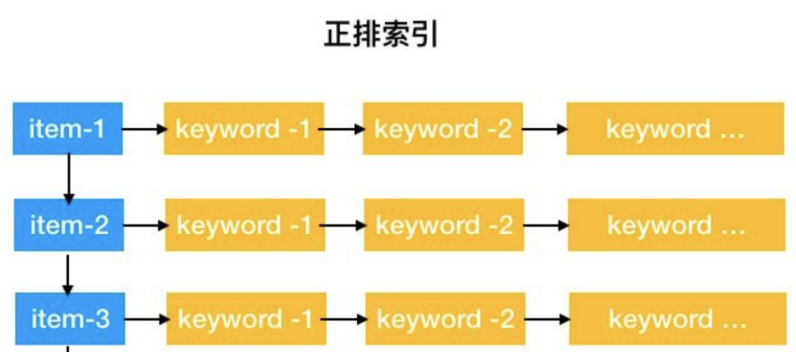
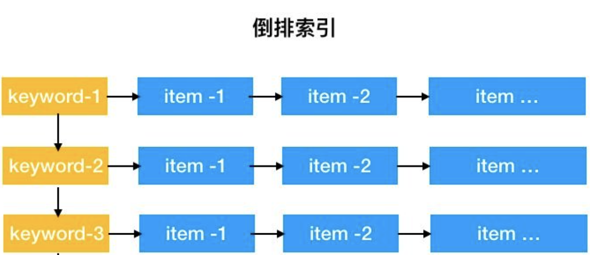
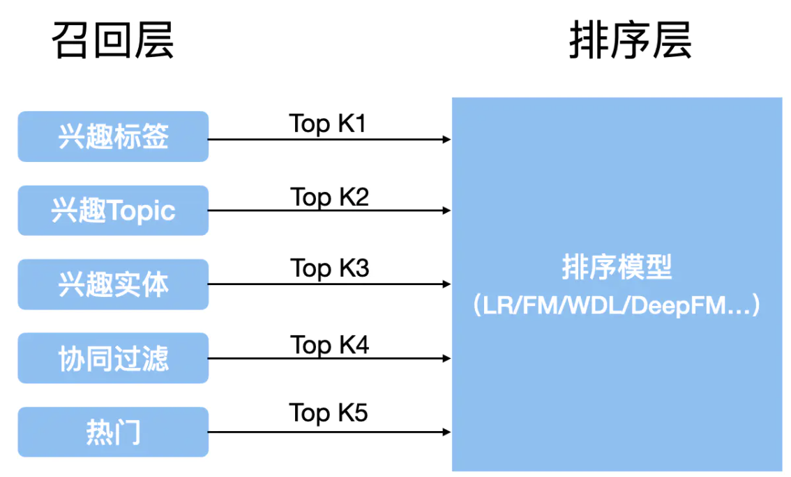
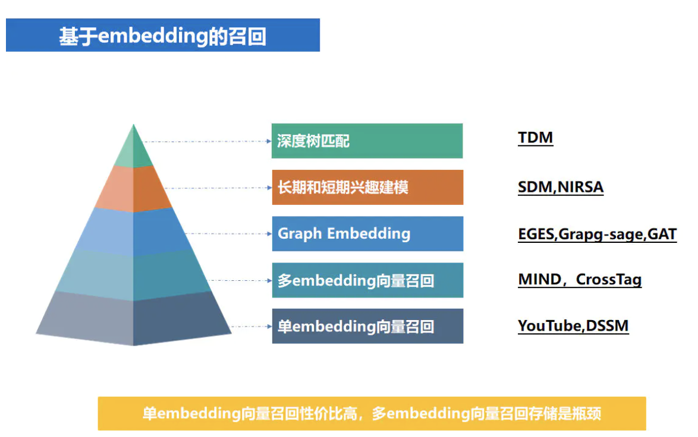

[TOC]

# 基于电商平台的商品召回

电商平台的实际案例中，一些常用的数据包含：用户画像和行为特征。我们将根据这些特征设计一个组合召回策略。实现商品召回。

**召回：从全量信息中触发尽可能多的正确结果，并将结果返回给排序。**

## 电商场景介绍

电商平台中，商品的数量种类繁多，比如在某电商平台中商品的数量约为3亿，商品的类目有1万多组，大的品类也有40多个，因此推荐系统不可能对所有的商品进行模型的预估，需要设计一些召回策略，在庞大的商品池中筛选出几百件或几千件的商品。另一个重要的指标是，耗时不能超过100毫秒。

### 类目介绍

在电商场景，广告场景中，通常会对许多的商品进行分类，例如雨伞，存在三个类目：

- 一级类目：日用百货
- 二级类目：挡风，遮雨，遮阳
- 三级类目：雨伞，太阳伞，雨蓬

其中二级类目基本上覆盖了该行业的所有商品，三级类目则具体到某一类的商品。

### 召回中倒排索引的应用

在推荐场景中，需要快速对商品进行分类检索，一个非常常见的方法就是对物料建立索引。物料表示为一系列字段内容的集合，每一条物料都有一个唯一的索引。我们可以利用这个物料唯一的ID去取到这条物料的各种字段，各个关键字。这既是通常意义下的正排索引：

**物料对应若干关键字**

然而在实际场景中，我们通常根据一些关键词，主题，检索到所有相关的物料，作为推荐的候选集。因此，对应关系变为：

**关键词对应若干物料，即倒排索引**

召回系统就是建立在上述的倒排索引系统之上的。召回的步骤为：

1. 对物料特征构建索引，获取对应item的索引列表
2. 对结果列表数据进行微计算，例如计算物料质量分等
3. 基于上述运算对物料进行综合排序，最后返回结果

上述过程涉及到大量的数据存储，查找，排序算法。

线上召回可以迅速地从倒排索引中，找到商品的key，根据key-value找到对应的商品列表。这样可以通过召回，把一个海量、无法把握的商品库变成一个相对小，可以把握的候选商品库。

### 索引的意义

召回系统的结果很大程度上依赖各路召回索引结果中的排序，以及索引数据的更新效率。如果一个新的商品没有建立索引的话，那么它一定不会被召回，直接影响到推荐的效果。所以推荐系统的时效性和索引的建立，更新效率有着重要的关系。

## 模型选择：多路召回策略

在设计召回模型的时候，我们需要兼顾召回的全面性，以及模型的计算速度。但是在实现上这两个指标是相互矛盾的。例如复杂的模型带来高的召回率，但是计算速度却将受到影响。

### 多路召回

考虑到上述原因，设计多路召回策略。每一个策略相互独立，利用并发多线程同时进行。多路策略像是摄像机，从多个角度对用户特征进行召回，一定程度上兼顾了全面性。

如上图，原始数据为**用户行为，用户兴趣，用户画像等**，召回层，利用不同的特征数据，返回各自策略的topK 物料排序。随后在排序层进行综合的排序，得到最终的排序列表。

### 融合排序

融合排序阶段按照一定的策略对候选的集进行排序，常见的融合方法有：

- 按召回顺序排序
- 平均法
- 加权平均
- 机器学习训练权重

多路召回同样存在着一些问题：例如每一路候选集的大小，以及融合权重等都是人为决定的超参数，不同策略之间相互独立没有学到相互的特征。

### 基于embedding召回

基于embedding的召回，利用多种网络模型对特征进行更好的交叉提取。同时结合多路召回的特点。是今后发展的一个重要方向。

## 多路召回代码部分

### 数据选择

天池推荐入门赛--新闻推荐

地址：https://tianchi.aliyun.com/competition/entrance/531842/information

开源代码：https://github.com/datawhalechina/team-learning-rs

**数据介绍：**

**数据分析：**

#### 模型选择

#### 模型实现

**资料：**

一份可以学习代码结构的开源：https://github.com/shenweichen/DeepMatch

