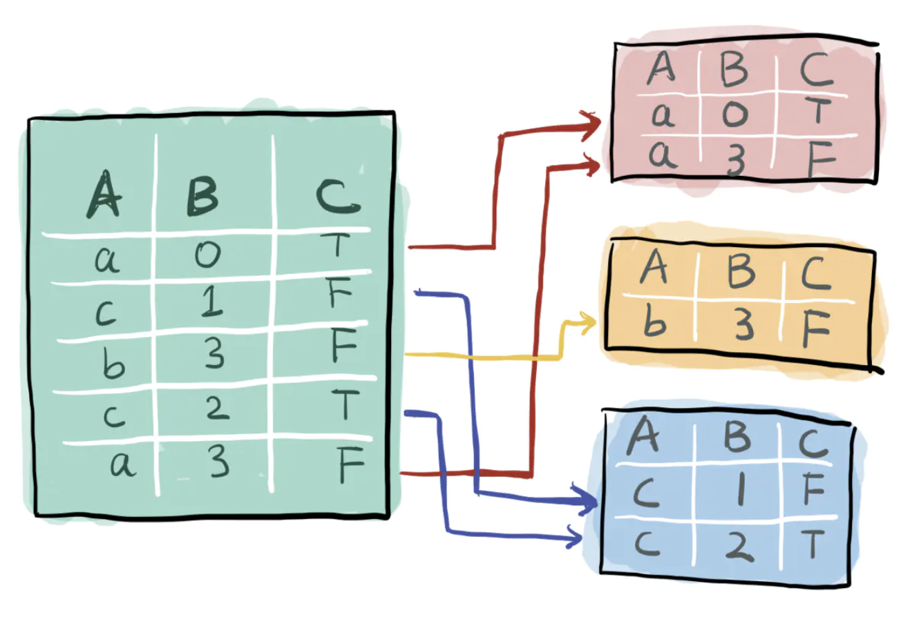

[TOC]

# 多路召回--新闻推荐数据分析(二)

数据分析在推荐过程中至关重要，帮助我们熟悉了解整个数据集的基本情况。对于了解数据集的相关性，推荐厂进行用户本身的基本属性，文章基本属性，以及用户和文章交互的分布，有利于后续选择召回策略，特征工程，同时对直观的可视化，说服别人有着很好的作用。

以下的这些方法可以推广到其他的数据集，同时，这些方法也是做ppt，说服别人很重要的工作，一定要详细，熟练。

数据分析设计的算法库：numpy，pandas，matplotlib等

由于涉及到大量的可视化操作，个人觉得用jupyter上做数据分析是很合适的。

## jupyter的基本用法

jupyter notebook是一个web交互式Python的计算环境。在程序可视化，文本说明markdown，公式latex上有着显著的优势。

启动jupyter：

```linux
jupyter notebook # 默认情况下启用当前的目录作为根目录
```

运行代码：

jupyter中代码按分块来组织，不同块可以做不同的功能使用，运行每一块代码的时候：

```shell
ctrl + Enter
```

## pandas常用的方法

此处使用criteo数据做例子。

读取数据：

```python
criteo_click = pd.read_csv(path + 'tiny.csv' )
```


拿到一个数据我主要关注，数据有多少列，数据内容是什么：

```python
criteo_click.shape
criteo_click.icol[0].values.tolist() # 从表中取数据
criteo_click.columns.values.tolist()
criteo_click.info() #查看每一类的数据类型
```

对历史记录做一些归类，排序：groupby

### groupby 操作

参考：https://www.jianshu.com/p/42f1d2909bb6

groupby可以视为将一个数据集按照xx进行分组，分组的结果可以视为分成了很多小的表。



这个表的数据类型是DataFrameGroupBy，没法直接显示，但是可以想象成上面的图。

DataFrameGroupBy的主要功能是不用写循环，就允许你快速对每一组进行操作。

#### 基本操作

取平均：

```python
data_frame.groupby('userId')['rating'].mean()
```


`mean`可以替换成`max,min,std,median`等。

计数`value_counts()`


`unstack`

可以看到上面数据有两层的索引，第一层是id，第二层是rating，`unstack`可以将第二层索引变成第一层，`stack`则反之：


按照不同的分组进行画图：


## 数据分析的思路

数据分析的过程主要目的是为了熟悉数据的结构。了解数据集中的文件，以及每个文件中有哪些属性特征。在推荐场景下，主要是分析用户的基本属性和文章的基本属性，有利于做召回特征的选择以及特征工程。

### 数据预处理

```python
# 对用户的点击时间戳进行排序
trn_click['rank'] = trn_click.groupby(['user_id'])['click_timestamp'].rank(ascending = False).astype(int)
# 计算用户点击文章的次数
trn_click['click_cnts'] = trn_click.groupby(['user_id'])['click_timestamp'].transform('count')
```

### 拼接两个文件

```python
trn_click = trn_click.merge(item_df,how = 'left',on = ['click_article_id'])
trn_click.head()
```

### 查看文件信息

```python
trn_click.info()

trn_click.describe() # 输出数据中的各种统计值，count，mean，std,min等
# 输出某个字段的数量
trn_click.user_id.nunique() 
# 输出文件中用户最少点击文章的数量
trn_click.groupby('user_id')['click_article_id'].count().min()
```


