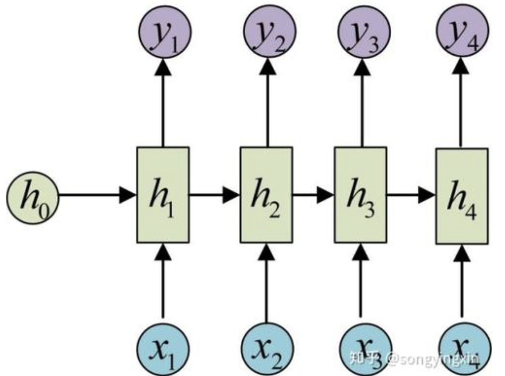
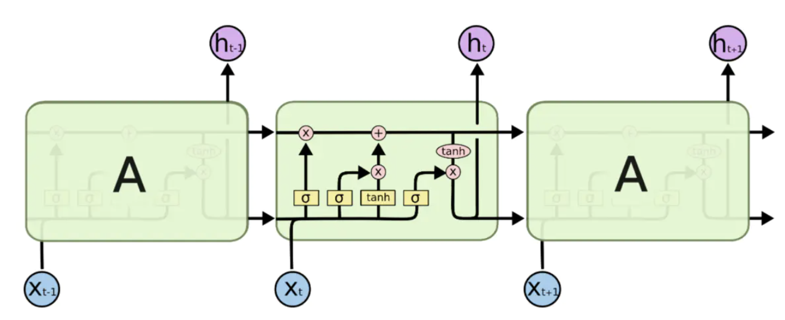

[TOC]

# 循环神经网络

## 循环神经网络介绍

循环神经网络最早在1982年提出，主要用途是处理和预测序列数据，循环神经网络是在不同时间位置共享参数，从而能够使用有限的参数处理任意长度的序列。

对于一个时间序列数据，可以将这个序列上不同时刻的数据依次传入循环神经网络的输入层，而输出层可以是对下一个时刻的预测。



```python
import numpy as np
x = [1,2]
state =[0.0,0.0]
w_cell_state = np.asarray([[0.1,0.2],[0.3,0.4]])
w_cell_input = np.asarray([0.5,0.6])
b_cell = np.asarray([0.1,-0.1])

w_output = np.asarray([[1.0],[2.0]])
b_output = 0.1
for i in range(len(x)):
  before_activation = np.dot(state,w_cell_state)+x[i]*w_cell_input + b_cell
  state = np.tanh(before_activation)
  final_output = np.dot(state,w_output) + b_output
  print(before_activation)
  print(state)
  print(final_output)
```

## 长短时记忆网络（LSTM）结构

LSTM可以解决时序问题中的长期依赖问题，LSTM采用一些门结构使得信息有选择性地影响循环神经网络中每个时刻的状态，门结构指的是sigmoid神经网络和一个按位做乘法的操作。



tensorflow 中LSTM可以被很简单的实现：

```python
# 通过tf创建一个完整的LSTM
lstm = tf.nn.rnn_cell.BasicLSTMCell(lstm_hidden_size)
state = lstm.zero_state(batch_size, tf.float32)
# 定义损失函数
loss = 0
for i in range(num_steps): # num_steps 序列长度
  if i > 0:
    tf.get_variable_scope().reuse_variables()
    lstm_output,state = lstm(current_input,state)
    final_output = fully_connected(lstm_output)
    loss += calc_loss(final_output,expected_output)
```

## 循环神经网络的变种

**双向循环神经网络**

双向神经网络解决状态的向前和向后传输问题。双向神经网络就是两个单项的循环神经网络结构，在每一个时刻t，输入会同时提供给这两个方向相反的循环神经网络。

**深层神经网络**

将多个RNN结构堆叠起来，将底层模型的输出作为上层模型的输入，使得最终的输入经过多层的迭代，提取出更加高层的信息。下面是简单的实现：

```python
lstm_cell = tf.nn.rnn_cell.BasicLSTMCell
stacked_lstm = tf.nn.rnn_cell.MultiRNNCell(
  [lstm_cell(lstm_size) for _ in range(number_of_layers)]
)
state = stacked_lstm.zero_state(batch_size, tf.float32)
for i in range(len(num_steps)):
  if i > 0:
    tf.get_variable_scope().reuse_variables()
  stacked_lstm_output,state = stack_lstm(current_input,state)
  final_output = fully_connected(stacked_lstm_output)
  loss += calc_loss(final_output,expected_output)
```

**循环神经网络 dropout**

dropout通常用在同一个时间点点但是不同层之间，而不是同一层。

tf中使用`tf.nn.rnn_cell.BasicLSTMCell` 实现dropout的功能。

```python
lstm_cell = tf.nn.rnn_cell.BasicLSTMCell
stack_lstm = tf.nn.rnn_cell.MultiRNNCell(
  [tf.nn.rnn_cell.DropoutWrapper(lstm_cell(lstm_size))
  for _ in range(number_of_layers)]
)
```


