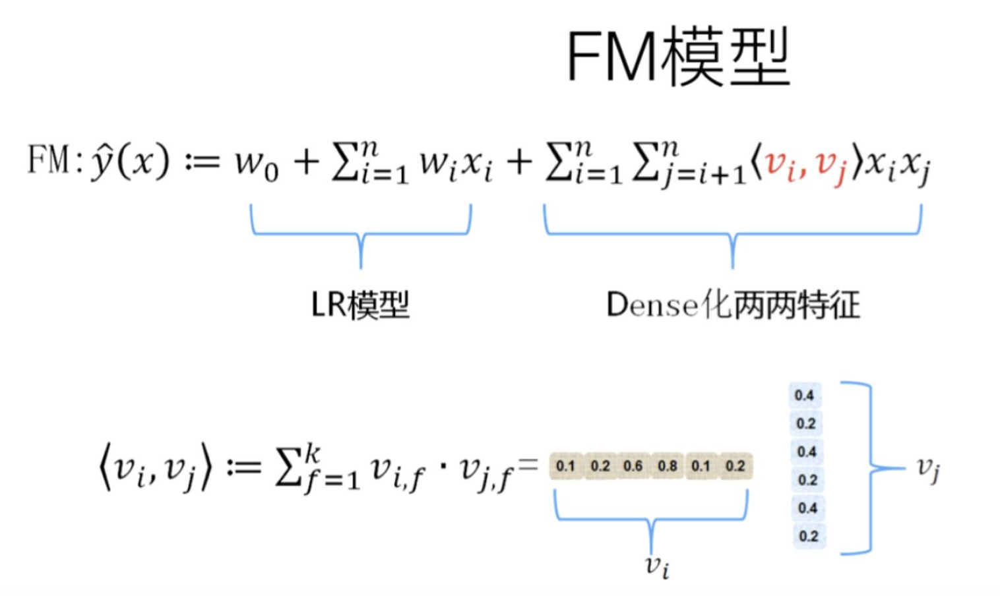
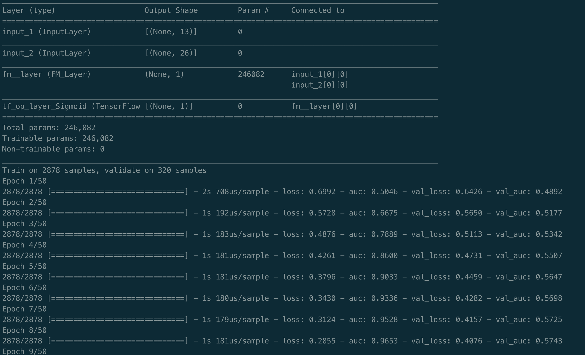
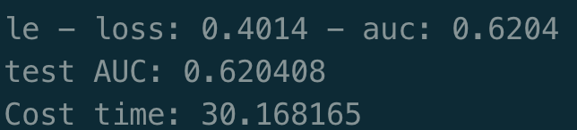

[TOC]

- [排序算法-线性模型-FM模型](#----------fm--)
  * [概述](#--)
  * [FM模型的作用](#fm-----)
  * [FM 模型](#fm---)
  * [FM模型的演化](#fm-----)
    + [特征组合方向：LR->FM](#-------lr--fm)
    + [协同过滤：MF->FM](#-----mf--fm)
  * [代码部分](#----)
    + [数据部分](#----)
    + [代码思路](#----)
    + [代码结果](#----)

# 排序算法-线性模型-FM模型

## 概述

FM模型即 Factorization Machine因子分解机，是2010年提出的一种基于矩阵分解的机器学习算法。FM模型的主要目标是，解决在数据稀疏的条件下，特征如何进行交叉的问题。

## FM模型的作用

- 实际过程中特征之间存在依赖关系不可忽视（LR视为相互独立）
- 非数值类型的数据one-hot编码后数据非常稀疏（维度大且含大量的0），难以学习到有效的特征

**一句话总结：FM模型将解决稀疏特征难以进行特征交叉的问题。**

## FM 模型

FM模型是通过多项式回归模型来加入特征间的关联性的。通常对相信模型增加一个二阶多项式：
$$
y= w_0 + \sum_{i=1}^{n} w_ix_i + \sum_{i=1}^{n-1} \sum_{j = i+1}^{n}w_{ij}x_ix_j
$$
上述多项式模型的二阶特征参数共有$n(n-1)/2$种，对于求解二次项参数$w_{ij}$需要大量的非零样本来求解，同时由于样本非常的稀疏，因此使得参数估计变得相当不准确，

FM模型引入矩阵分解的思路，对二阶参数进行如下分解:
$$
w_{ij} = <v_i,v_j>
$$
这个分解过程类似CF协同过滤，将评分矩阵用用户矩阵和商品矩阵表示，然后用户矩阵和商品矩阵点乘即得到评分矩阵。FM模型公式可以转化为：
$$
y= w_0 + \sum_{i=1}^{n} w_ix_i + \sum_{i=1}^{n-1} \sum_{j = i+1}^{n}<v_i,v_j>x_ix_j
$$
在进一步对公式进行简化，得到：
$$
FM = w_0 + \sum_{i=1}^{n}w_ix_i + \frac{1}{2}\sum_{f=1}^{n}((\sum_{i=1}^{n}v_{i,f}x_i)^2 + \sum_{i=1}^{n} v_{i,f}^{2}x_i^2)
$$
可以看出来，**二次项转化为两个向量相乘求和的平方，减去两个向量平方之后相乘求和。**模型复杂度由$O(kn^2)$变成了$O(kn)$。

## FM模型的演化

### 特征组合方向：LR->FM

 LR是最早在CTR预估中成功的模型，采用 **线性模型 + 人工组合引入非线性** 的模式，LR模型最大的缺点就是人工特征组合耗时耗力：
$$
LR = \frac{1}{1 + e^{-wx}}
$$
有没有办法从模型的角度加入这种特征组合呢？一个比较直观的思路就是在上式中加入二项式特征组合。FM模型则是在二项式特征模型基础上对二阶参数进行的因子分解：

因子分解降低了算法的复杂度，同时克服了大量稀疏数据难以学到有效特征组合，二阶参数特征估计不准确的问题。

### 协同过滤：MF->FM

MF即矩阵分解，R = uv。核心思想是通过两个低维的矩阵的乘积（用户矩阵，商品矩阵），来表示用户的评分矩阵。上述矩阵分解的过程可以看成是从用户兴趣矩阵中提取出用户的embedding以及商品的embedding，MF模型则可以看做是简化版的FM模型。MF模型对用户以及商品的特征进行组合，而FM模型则可以引入很多其他的特征类型。它将这些多种特征转化为低维的embedding，去计算任意两个embedding的内积，得到特征的组合结果。

在实际场合中，解决问题的思路可以是：LR->FM->deepFM。

## 代码部分

### 数据部分

数据采用criteo数据进行测试（tiny）

> criteo数据集第0列为label，即是否点击过。
>
> L1-l13为整数连续性数据，处理时候进行归一化
>
> C1-C26为类别数据，值经过hash匿名处理，处理时使用labelEncoder进行编码

### 代码思路

首先处理数据，将L1-L13的数据进行归一化，采用sklearn中的minmaxprocessing。进行归一化。

C1-C26先用labelEncoder进行编码，然后对他进行one-hot编码。

然后将dense和sparse数据组合concat在一起，送入FM中。

FM网络有FM_Layer，FM_model，FM（负责训练）组成。

FM中有一阶和二阶两部分数据。

### 代码结果

