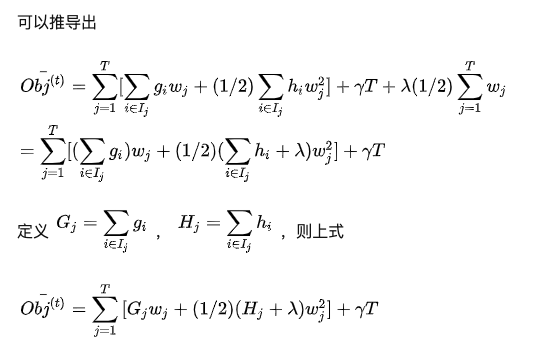
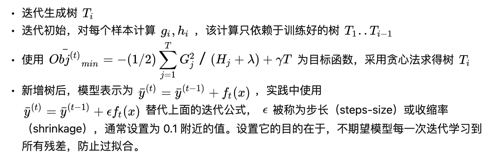

[TOC]

- [树模型](#---)
  * [决策树算法](#-----)
    + [特征选择](#----)
      - [熵](#-)
      - [信息增益](#----)
      - [信息增益比](#-----)
      - [基尼系数](#----)
      - [方差](#--)
    + [决策树的生成](#------)
      - [ID3 信息增益分裂准则](#id3---------)
      - [C4.5 信息增益比分裂准则](#c45----------)
      - [CART基尼系数分裂准则](#CART----------)
    + [决策树的剪枝](#------)
  * [决策树的集成学习](#--------)
      - [Bagging 方法](#bagging---)
      - [Boosting 方法](#boosting---)
      - [GBDT实现细节](#gbdt----)
  * [GBDT算法](#gbdt--)
    + [优化目标](#----)
    + [损失部分](#----)
    + [树复杂度部分](#------)
    + [贪心法寻找分裂点](#--------)
  * [代码实现](#----)
    + [实验准备](#----)
    + [代码思路](#----)
    + [实验结果](#----)

摒弃浮浅工作

# 树模型

树模型包括了决策树、随机森林、GBDT、深度森林等。树模型的优点是可以通过有监督的方式，进行特征的自动交叉和选择。是机器学习中的经典算法，既可作分类模型也可以做回归模型。

## 决策树算法

决策树是一个树结构，节点有两种类型，内部节点为特征或属性，叶子节点为类别。

决策树的核心为：**从训练数据中归纳出一组分类规则，采用局部最优的方法，逐步达到。**

决策树学习通常分为三个步骤：特征选择、决策树生成、决策树剪枝

### 特征选择

特征选择（即分裂的条件，如是否为学生）的原则是采用局部最优，使得分类到同一组的数据更加的有序。纯度越高则分裂效果越好。

评价这种纯度的指标有熵、基尼指数、方差

#### 熵

熵是一个物理概念，指的是混乱程度。当一个发生概率很高的事情发生的时候，我们习以为常，这件事没有什么信息量（太阳升起）。但是当一件发生概率很低的事情发生的时候，对我们的冲击是很大的（发生地震）。熵的表达式如下：
$$
I_e = -\log_2p_i
$$
图像处在log上升曲线0-1之间。

我们终极目标是最求熵最小，事情最可预测，系统最稳定的状态。（这种稳定的收益是否存在一个上界呢，答案是显然的。人心是不安分的，事情是一直在变化之中的。）

因此我们希望在树的分裂过程中，分裂前后熵减最大，即分裂后更加的稳定。于是现在面临的问题转化为如何描述每个事件的熵、以及如何找到熵减最大的分裂。

一个事件是否发生以及他本身的信息量决定了这个事情带来的冲击程度（中彩票和大地震的影响是不同的），因此这个事件的信息熵可以表示为：
$$
H(x) = -\sum_{i=1}^{n}p(x_i)log_2p(xi)
$$
即发生概率与本身的熵的乘积。

#### 信息增益

如何确定熵减最大呢，即当前节点，我选择特征A最为分裂的条件，分裂之后树的熵与分裂之前树的熵的差值：
$$
g(D,A) = H(D) - H(D|A)
$$
H(D|A)即特征A作为划分条件，得到的信息熵，计算方式为：
$$
H(D|A) = \sum \frac{|D_i|}{|D|}H(D_i)
$$
即选中样本的概率乘上样本具有的熵。

信息增益有一个缺点，即他倾向于分类多的那一个属性。即每个样本的id的独有的，信息增益会选择这个属性，因为得到的样本最稳定，但是对我们的归类任务来说，将每个样本划为一类没有意义，因此我们需要进行改进：信息增益比。

#### 信息增益比

由于分裂本身也会带来熵的变化，当分类越细的时候，带来的分裂信息熵也就越大（分类越细每一个样本属于某一类的概率越小），分裂信息熵表示为：
$$
split_{info}(A) = -\sum \frac{|D_j|}{|D|} \log_2 \frac{|D_j|}{|D|}
$$
信息增益比既顾及到分裂后的熵，也估计到分裂过程中分裂的分支树少：
$$
g_R(D,A) = \frac{g(D,A)}{split_{info}(
A)}
$$

#### 基尼系数

基尼系数从另一个角度出发，对不纯度进行衡量，认为不纯度越高基尼系数越高。他的表达式是类别概率乘以错分概率：
$$
jini = \sum_{i=1}^{C} f_i(1-f_i)
$$
通常认为对一个二分问题来说，0.5是分类错误的下限（乱选的概率）。因此此时基尼系数最大。当概率越高，错分机会越小，基尼系数也越小。

#### 方差

方差也是衡量纯度的指标：
$$
\frac{1}{N} \sum_{i=1}^{N} (y_i - u)^2
$$
u为所有样本的均值，y是某个实例的标签，方差越大数据越是不纯。

### 决策树的生成

生成方式即分裂原则的选择方式，不同选择方式的决策树称呼也不一样。

#### ID3 信息增益分裂准则

ID3在进行分裂的时候，选择产生最大的信息增益的特征作为分裂的标准。

#### C4.5 信息增益比分裂准则

C.4.5是ID3的改进版本，选择信息增益比作为分裂的准则，这样做避免了多分类的倾向（选择id）。

### CART 基尼系数分裂准则

CART基于基尼系数进行分裂

### 决策树的剪枝

决策树由于分裂规则的限制，容易发生过拟合的现象，因此要对树进行剪枝。

剪枝的目标是达到预测误差和树复杂度之间的平衡。

预测误差是所有叶节点经验熵之和：
$$
C(T) = \sum N_tH_t(T)
$$
数复杂度即节点的数量，因此最后表示为：
$$
C_a(T) = C(T) + \alpha|T|
$$
剪枝的原则就是保证上式最小。方法是比较剪枝前后的C值，选择较小的C值的方案。

## 决策树的集成学习

在实际应用中，决策树方法常用于集成学习。最常见的是随机森林和GBDT算法。

#### Bagging 方法

决策树由于分离的原则是固定的，因此得到的决策结果也是固定的，难以得到提升。如何对这个结果进行改进呢，可以利用多棵树进行预测，然后投票产生结果。（我们作为先知，觉得很多想法非常简单，不值得一提。原因是这个问题不是直接抛向你的）

bagging方法将数据采样成N份，每一份训练一个决策树，当新来一个物品，利用N个决策树共同决策，最终的结果投票产生。

**随机森林**采用的表示这种方法，每棵树的决策权重相同。

#### Boosting 方法

跳出这种约束，由于数据唯一决定了树，我们还能想什么方法呢。再一次作为先知，我们说可以增强错分样本的权重，为每一课决策树赋予决策的重要性。

boosting的主要思路是：

1. 首先采集N个样本训练第一个分类器
2. 计算该分类器的错误率e
3. 根据错误率计算这个分类器的可信度（投票权重），以及更新采样权值D（错误样本重复采样概率大）
4. 训练第二个分类器，重复上述步骤，直到训练N个分类器
5. 根绝每个分类器的可信度加权进行投票

**GBDT是adaboost家族的成员，正是采用这样的方法来训练网络的。**

#### GBDT实现细节

对GBDT算法的详细介绍：https://zhuanlan.zhihu.com/p/30339807

GBDT生成树的过程：

1. 从深度为 0 的树开始，对每个叶节点枚举所有的可用特征
2. 针对每个特征，把属于该节点的训练样本根据该特征值升序排列，通过线性扫描的方式来决定该特征的最佳分裂点，并记录该特征的最大收益（采用最佳分裂点时的收益）CART
3. 选择收益最大的特征作为分裂特征，用该特征的最佳分裂点作为分裂位置，把该节点生长出左右两个新的叶节点，并为每个新节点关联对应的样本集

选择分裂点利用了CART的思想，计算收益用到了Boosting的思想（负梯度方向优化）

## GBDT算法

GBDT算法在模型演化历史中有着很重要的地位，GB指的是Gradient Boosting，即Boosting的方法，每次注重训练错分的样本（负梯度方向）。DT则是指的CART决策树群。（CART使用基尼指数作为分裂的标准。）

xgboost是GBDT的一个改进版本，下面介绍他的实现原理（与GBDT基本相同）

输入一个样本，模型最终的输出为各个树输出的和：
$$
\bar{y}=\sum_{k=1}^{K} f_{k}(x), f_{k} \subset \Gamma
$$

### 优化目标

为了得到一个森林，我们必须找到一个优化对象，与剪枝策略相同，我们选择损失函数与树复杂程度作为优化目标：
$$
O b j=\sum_{i=1}^{n} l\left(y_{i}, \bar{y}_{i}\right)+\sum_{k=1}^{K} \Omega\left(f_{k}\right)
$$
前半部分为模型的损失，$y_i$为当前树的输出，$\hat{y}_i$ 为GBDT的输出。$l()$ 可以使简单的L1或L2。

### 损失部分

$\hat{y}_i$ 具体是怎么算的呢，由于GBDT是一种追加训练方式训练的模型，因此每次GBDT的输出由两部分组成，一部分是之前树的输出，另一部分是新加入的树的输出：

回顾一下泰勒公式，用高阶导数无限逼近真实函数：
$$
f(x+\Delta x) \simeq f(x)+f^{\prime}(x) \Delta x+(1 / 2) f^{\prime \prime}(x) \Delta x^{2}
$$
我们利用泰勒展开对obj进行求解：
$$
O b j^{(t)}=\sum_{i=1}^{n}\left[l\left(y_{i}, \bar{y}_{i}^{(t-1)}\right)+g_{i} f_{t}\left(x_{i}\right)+\left(\frac{1}{2}\right) h_{i} f_{t}^{2}\left(x_{i}\right)\right]+\Omega\left(f_{t}\right)+\text { constant }
$$
其中constant是已有的树的复杂度。$g_i,h_i$ 是目标函数的一次导数和二次导数（例如损失为L2损失）。由于前面t-1棵树都确定了，求解上述方程最小可以简化为：
$$
\overline{O b} j^{(t)}=\sum_{i=1}^{n}\left[g_{i} f_{t}\left(x_{i}\right)+(1 / 2) h_{i} f_{t}^{2}\left(x_{i}\right)\right]+\Omega\left(f_{t}\right)
$$

### 树复杂度部分

xgboost中定义树的复杂度如下：
$$
\Omega\left(f_{t}\right)=\gamma T+\left(\frac{1}{2}\right) \lambda \sum_{j=1}^{T} w_{j}^{2}
$$
T为叶子节点的个数。w为每个节点的输出。

总的目标函数可以化简为：
$$
\begin{array}{l}\overline{O b} j^{(t)}=\sum_{i=1}^{n}\left[g_{i} f_{t}\left(x_{i}\right)+\left(\frac{1}{2}\right) h_{i} f_{t}^{2}\left(x_{i}\right)\right]+\Omega\left(f_{t}\right) \\ =\sum_{i=1}^{n}\left[g_{i} w_{q\left(x_{i}\right)}+(1 / 2) h_{i} w_{q\left(x_{i}\right)}^{2}\right]+\gamma T+\lambda(1 / 2) \sum_{j=1}^{T} w_{j}\end{array}
$$
进一步化简：

对上式求导取最小值：
$$
w_{j}^{*}=-\left(G_{i} /\left(H_{j}+\lambda\right)\right)
$$

$$
O \overline{b j}_{m i n}^{-}=-(1 / 2) \sum_{j=1}^{T} G_{j}^{2} /\left(H_{j}+\lambda\right)+\gamma T
$$

至此，我们可以得到任何一棵树的目标函数值，接下来就是枚举所有可能的树的结构，选择目标函数最小的那一棵。

可以看出来GBDT和CART，C4.5等的区别了，GBDT采用的是这样一种分裂准则进行分裂，同时考虑到树的复杂性，以及样本的错分。

### 贪心法寻找分裂点

理想是美好的，但是枚举却不现实。

因此使用贪心法找到最佳分裂点，使用线性扫描来找到最佳分裂点，使得下式最小：
$$
\text {Gain}=\frac{1}{2}\left[\frac{G_{L}^{2}}{H_{L}+\lambda}+\frac{G_{R}^{2}}{H_{R}+\lambda}-\frac{\left(G_{L}+G_{R}\right)^{2}}{H_{L}+H_{R}+\lambda}\right]-\lambda
$$
总结算法如下：

## 代码实现

### 实验准备

### 代码思路

### 实验结果

