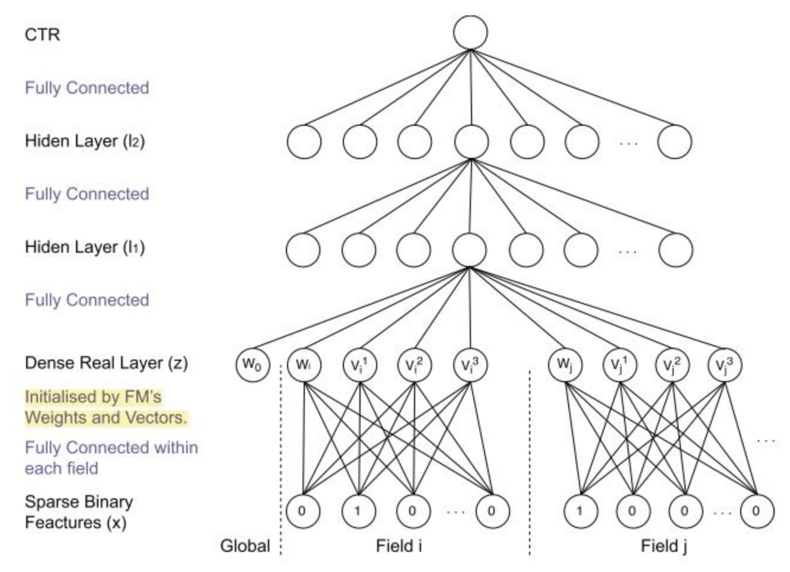

[TOC]

- [度学习模型](#-----)
  * [CTR数据的特点](#ctr-----)
    + [高维度特征难以学习](#---------)
    + [LR模型和GBDT模型在遇到高维特征的表现](#lr---gbdt------------)
    + [基于embedding的表示](#--embedding---)
  * [基于深度学习的推荐模型](#-----------)
    + [DNN优化高阶特征](#dnn------)
    + [高阶特征交叉与低阶特征交叉](#-------------)
    + [特征交叉优化](#------)
    + [特征连接优化](#------)
    + [高阶特征交叉优化](#--------)
    + [多样性的深度兴趣特征优化](#------------)
  * [总结](#--)

# 深度学习模型

近些年，在个性化推荐系统方面，CTR预估领域近些年有大量的深度学习方面的研究。近些年来，深度学习方法集中的应用在图像，语音，NLP等领域，这些领域的共同特点是，数据集是连续的。

从2016年开始，各种DNN开始应用于推荐系统中，遇到的第一个问题便是：**高维系数离散特征如何处理。**下面将从推荐数据特点，模型演化方面，了解一些相关的工作，以及一些自己的感悟。

## CTR数据的特点

- 数据中包含大量的离散数据，如年龄，地域，设备属性，兴趣分类等
- 数据包含大量高维度稀疏特征
- 特征交叉或组合对预测效果非常关键

在广告领域，由于我们采集的数据通常包含多个类别，这些原始的特征通常以one-hot的形式转化为高维稀疏的二值特征，将多个特征的one-hot concate 在一起，构成最终的特征。

这样的特征典型特点是：**高维，稀疏，多种类**

### 高维度特征难以学习

高维度特征的特点是数据中含有大量的0，当我们将这样的特征直接用于网络学习的时候，那么仅有非0位置上的神经元参与了训练，训练过程十分的低效，网络没法得到充分的训练。

此外，高维度特征数据维度大，需要构建庞大参数的网络层，才能过对其进行训练。

总结一下：特征维度大（很长），使得模型参数多，0值多，使得参数无法充分训练。

### LR模型和GBDT模型在遇到高维特征的表现

**LR模型适合高维特征：**LR模型目的是寻找高维空间中的一个分界面，高维数据具有更好的可分性

**GBDT模型不适合高维特征：** GBDT在处理特征的时候，是逐个特征进行分裂的，当数据中存在大量的0，特征选择将非常的低效（0和0之间没差），一些有效的划分只会发生在非0值的部分，因此对于噪声非常敏感（本来非0值就不多），此外特征分得过细，容易使得模型发生过拟合。

### 基于embedding的表示

对于离散数据的处理，我们使用的方法是将特征转化为one-hot模型，然后拼接在一起。然后通过隐含层映射到低维稠密空间。把位数较多的稀疏数据压缩到位数较少的空间中，类似于一种软聚类，最终将这种低维稠密的向量输入其他网络中进行进一步的学习。

## 基于深度学习的推荐模型

CTR预估是一直是学术界乃至工业界的一个重点研究领域，下面讲解经典模型的设计初衷以及演化过程中主要解决的问题。

**总的来说，推荐模型核心关注点在于：稀疏特征的处理，以及如果高效的，各种形式的做特征交叉**

### DNN优化高阶特征

如上一节所描述，广告特征的特点多类别，高维稀疏的，我们将embedding的结果直接输入网络中，将得不到预期的效果。因此问题转到对数据的处理上。

onehot过于稀疏如何解决呢，我们可以采用类似FFM的思路，首先对不同特征进行域的划分，然后将不同域的onehot经过一层隐含层得到稠密embedding。这样比直接经过隐含层然后输出稠密embedding得到的特征效果更好。很自然的优化方向。

**原始输入数据**：分类离散特征，转化为onehot，连续特征归一化。然后将这两种特征concate在一起

**处理后的数据**：将不同域特征onehot编码输入隐含层，然后得到不同域稠密的输出，然后再concate在一起

为了让不同的域特征能够进行充分的交叉，可以对输出的稠密特征加上两层全连接层，这样高阶特征就交叉出来了。这样的做法就是FNN模型的经典做法。

此外，为了使得连续特征能够和离散特征充分交叉，每一层都可以加入一些连续特征，concat到上一层输出，然后进行训练。 

**总结：几乎所有的深度模型，对输入部分的处理均与此网络类似。稀疏转为稠密后参与训练。**

### 高阶特征交叉与低阶特征交叉

对高低阶特征的交叉总的来说有两种形式：

一种是并行结构，代表如：wide&deep,deepFM,DCN等。对离散特征使用DNN进行高阶特征交叉，对连续特征使用FM进行低阶特征交叉，最后通过输出层对高阶部分和低阶部分进行连接。如下图wide&deep:

可以看出来这种结果是LR + DNN的组合的并行结构。

一种是串行结构，例如PNN，NFM等，他的特点是，离散数据经过dense层输出为稠密特征，然后就与连续特征进行concat，然后共同输入到FM模型中，FM模型的输出再作为DNN层的输入。

### 特征交叉优化

上面模型描述可以看出来，我们的输入数据是，高维稀疏特征经过一层隐层得到的稠密数据，这样的稠密数据有些学者认为期间的特征学习，特征交叉并不充分（十分自然的认为）。因此提出特征交叉层的思想，在一层隐层的后面，再接一层特征交叉层即PNN所做的工作：

特征交叉层由两部分组成，第一部分是线性的特征，第二部分是embedding乘积的结果，乘积有两种方式，一种是点乘，另一种是叉乘。

### 特征连接优化

前面的模型，在做特征的连接的时候，直接进行concat处理，然后作为DNN的输入。此处也明显存在优化的空间，例如不同file的重要性不同等等，因此一些工作在这个上面做文章。

NFM模型提出了一个BI-Interaction结构，将各个field进行累加之后，然后再去做特征的交叉。输出一个固定长度为k的embedding，然后将这个embedding输入MLP中。

此外也有带attention的链接方式，通过训练一个attention参数的方式，将特征进行concate。

### 高阶特征交叉优化

FM模型等这些模型，做特征交叉的时候，通常只涉及到二阶（低阶）的特征交叉。要想要做更加高阶的交叉，则需要使用DNN模型，google提出可Deep&Cross Network 即DCN，可以进行任意阶的特征交叉。Corss部分使用递归累乘，而deep部分则是DNN结构：

### 多样性的深度兴趣特征优化

阿里巴巴在2017年提出的DIN则引入了更高阶的学习范式，用户的兴趣是多种多样的，从数学的角度看，用户的兴趣在兴趣空间中是一个多峰分布。在DIN中，专门提出一个结构Action Unit来提取用户的兴趣分布。DIN的网络结构如下：

## 总结

从推荐的发展和模型的演化可以看到一条主要的发展思路。

推荐系统模型有一个通式：将离散的类别数据进行编码然后转化成ont-hot形式，拼接成一个高维的稀疏向量，然后通过隐含层处理，生成稠密的向量。设计模型，对这个稠密的向量特征进行花式的交叉。（google研究表明，花式交叉能够更好的反应用户特征）

在上面这个思路上，存在着很多的优化，首先是DNN结构提取高阶的特征交叉，DeepFM等提取高阶特征交叉和低阶（FM二阶）的特征交叉。在稀疏向量转为稠密向量的时候，PNN提出特征交叉层，让这个过程交叉更加充分。在特征连接的时候，一般直接使用concat，NFM则通过累加后交叉输出一个k维向量，AFM模型则是去学不同域的特征权重。DCN模型对高阶特征进行充分交叉，任意阶的交叉。 然后是DIN模型，从更加高阶的认知层面上，学习用户的兴趣点分布。

此外还有非常多其他的模型，例如一些图结构，也在尝试引入高阶的学习方式，完成特征的花式交叉。

之前看过一篇模型，说渴望推荐领域出现像CV中CNN，NLP中bert的现象级作品，可以看出，推荐系统目前样式还是非常的单一，急待有惊人的突破。使得大家从交叉中脱身，然后投入下一个交叉里头（逃）。

