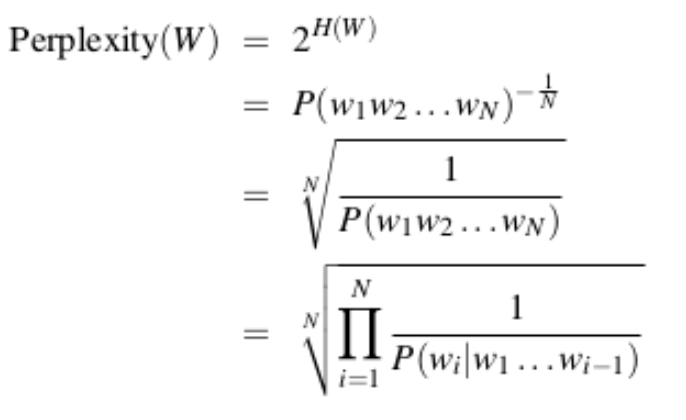

[TOC]

# 自然语言处理

## 语言模型简介

每一门语言中所有可能的句子服从某一个分布，每个句子出现的概率为1，那么语言模型的任务就是预测每个句子在语言中出现的概率。对于语言模型中，一个好的语言模型因得出相对高的概率。相当于在给定输入的情况下，对目标语言的下一个句子进行估算。模型通常采用最大似然估计。

## 语言模型的评价方法

语言模型通常通过刻画复杂度来完成：



该指数可以认为是平均分支系数，即模型预测下一个词的平均可选择数量。使用交叉熵损失来计算网络输出的损失：

```python
tf.nn.sparse_softmax_cross_entropy_with_logits()
tf.nn.softmax_cross_entropy_with_logits() # 输入是概率值
```

由于计算机难以处理文本数据，需要将文件数据转化成单词序列，然后为每一个单词分别映射一个0-9999之间的整数编号，然后将词汇表保存到一个独立的vocab中。下面是代码部分：

```python
import codec
import collections
from operator import itemgetter

raw_data = './data.train.txt'
vocab_output = 'ptb.vocab'
counter = collections.Counter()
with codec.open(raw_data,'r','utf-8') as f:
  for line in f:
    for word in line.strip().split():
      counter[word]+=1
# 词频排序
sorted_word_to_cnt = sorted(counter.items(),key=itemgetter(),reverse=True)
sorted_words = [x[0] for x in sorted_word_to_cnt]
sorted_words = ["<eos>"] + sorted_words
with codes.open(vocab_output,'w','utf-8') as file_output:
  for word in sorted_words:
    fiel_output.write(word + '\n')
```

随后将原始文本数据中的单词替换成编号，得到word_to_id的一张大表，然后保存成TFRecord文件。供之后使用。

### 数据集batching的方法

在对本文数据进行batch的时候，我们需要采取一些特殊的操作，最常见的是使用填充，将同一batch内的句子长度补齐。对于一些有上下文关系的数据集，如果模型大小没有限制，那么最好的方式就是将整个文档前后连接起来。当现实中一般是不可能的。

一般的操作是先将整个文档切分成若干连续段落，再让batch中的每一个位置负责其中一段，这样每个文档内部所有数据仍可以被顺序处理。

### 基于循环神经网络的神经语言模型

**词向量层**

在输入层对每一个单词使用一个实数向量表示，这个向量被称为词向量，将单词编号，转化成词向量的作用为：

1. 降低输入的维度，如果将单词以one-hot的形式直接输入神经网络中，那么输入的维度大小与词汇表的大小相同，通常非常的大，而使用词向量可以将维度降低到200-1000之间，减少参数数量。
2. 增加语义信息，将稀疏的编号转化成稠密的向量表示，可以使得词向量包含更为丰富的信息。

假设词向量的维度为emb_size，词汇表的大小为vocab_size，那么所有的单词词向量可以放入一个大小为vocab_size X emb_size大小的矩阵中，读取词向量的时候，调用`tf.nn.embedding_lookup`：

```text
tf.nn.embedding_lookup(params, ids, partition_strategy='mod', max_norm=None)
```

这个函数的**目的是按照ids从params这个矩阵中拿向量（行）**，所以ids就是这个矩阵索引（行号），需要int类型。

**softmax层**

softmax层的作用是将循环神经网络的输出转化为一个单词表中每个单词的输出概率。通常我们使用`tf.nn.sparse_softmax_cross_entropy_with_logits` 直接从logits中计算log作为损失函数。

**共享参数减少参数的数量**

softmax层与vocab_size成正比，由于单词量很大，因此softmax层，embedding参数非常的多，因此我们通过共享这两层的参数，可以极大地减小参数的数量。

### 代码实现如下

[代码地址](../Code/tensorflow/ptb_model.py)


