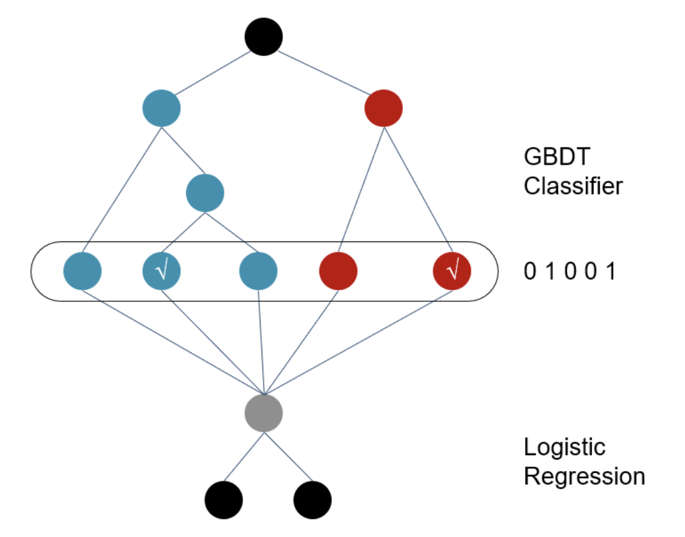

[TOC]

# 集成学习

集成学习的特点是将多个单一学习模型有机的结合在一起，然后获得一个统一的集成学习模型。从而获得更加准确，稳定和健壮的结果。

## GBDT + LR

LR模型是CTR预估中常用模型，但该模型学习能力有限，需要通过大量特征工程预先分析出有效的特征，特征交叉，从而间接增强LR的非线性学习能力。

常用的特征交叉的方法有FM（二阶特征自动交叉），以及GBDT。

### GBDT + LR 网络模型

GBDT+LR网络结构可以有多种多样，主要根据其所处理的特征类型来划分，树模型不太适合处理高维稀疏离散数据。

#### Facebook 采用的GBDT+LR思路

首先用已有的特征训练GBDT模型，然后利用GBDT模型学习到的树来构造新特征，最后把这些新特征加入到原有特征中一起训练模型。

GBDT处理特征：当输入一个特征为x，经过GBDT中的一棵树处理后，落在某个叶子节点上（叶子节点是一个类别）。那么这个叶子节点为1，其他为0。例如有三棵树，就有三个onehot embedding，然后将这个embedding连接起来组成一个GBDT生成的特征。

GBDT模型能够学习高阶非线性特征交叉，对应数的一条路径就是一组高阶特征交叉。**通常把一些连续值特征，值空间不大的离散特征都丢给GBDT模型，**空间很大的ID特征，则留在LR模型中进行训练，这技能做高阶特征交叉，又能利用线性模型抑郁处理大规模稀疏数据。

**一句话总结：连续或值空间不大的离散特征，通过GBDT进行编码，与离散特征相结合，最终输入到LR中。**

如下图：

在GBDT输出将得到一串one-hot编码，然后输入LR中得到最终的分类。

## 深度森林算法

将深度学习方法与决策树相结合，提出gcForest（多粒度级联森林）是一种全新的决策树集成方法，使用级联结构让gcForest做表征学习。

### 级联森林

gcForest采用级联结构堆叠决策树，用上一层的决策树输出的结果，作为下一层决策树的输入，通过多层的堆叠达到数据深层数据的交叉。每个决策树的结构都是相同的。例如一个三分类的问题，决策树的输出为三个元素的向量。最终结果为取平均值后，取最大值得到最后的分类结果。

### 多粒度扫描

多粒度扫描使用滑动窗口在embedding上扫描，得到n个输出的embedding，然后将这些embedding输入到级联的森林中，得到最终的输出。可以理解成数据首先经过卷积结构得到多粒度数据，然后将多粒度数据输入到级联森林得到最终的结果。

此外还可以将GBDT和random Forest结合在一起，达到集成学习的目的。

## 代码实现

### 实验准备

### 代码思路

### 代码结果

