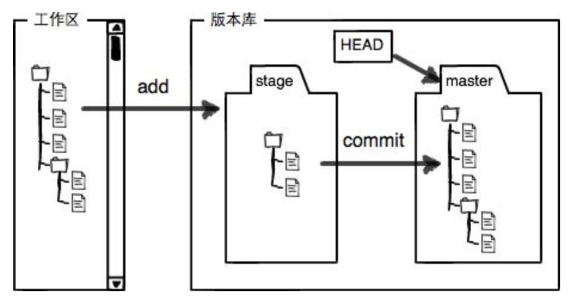

[TOC]

# github 指令介绍

## git的原理

Git的核心是对象数据库，其中三类核心的对象为：

- **blob对象：**实现对文件内容的记录；对象保存在.git/objects； 

- **tree对象：**实现对文件名，文件结构的记录以及变更过程；对象保存在暂存区.git/index文件中

- **commit对象：**实现对版本提交时间，作者信息，版本说明的记录；

  

## github 提交代码

### 上传代码的三个步骤

```git
git add filename
git commit -m 'detail'
git push
```

### github的分区管理与代码上传

git以分区的形式管理文件，主要是两大分区：

**工作区：**即当前的工作路径，保存着自己写的代码

**版本库：**在当前工作区下有一个隐藏的文件夹.git，这边是git的版本库，实现版本的管理。

版本库中存了很多东西，其中最重要的是stage（index暂存区），还有git为我们自动生成的第一个分支master，以及指向当前分支的HEAD指针。

工作区与版本库之间的关系如下图：




因此代码提交的步骤可以看成：

1. git add filename： 将文件从工作区提交到暂存区(index)中
2. git commit -m "note" ： 将文件从暂存区提交到当前head指向的分支上
3. git push将当前分支提交到服务器上

**为什么要有暂存区：**一个说法是，我们可以一个个的修改文件，然后一次性commit到当前分支上，比较有灵活性。因为有些修改我们可能不希望提交。

### 查看代码状态 git status

git status可以查看：

1. 当前工作区文件是否被追踪，是否存在文件修改没有提交到暂存区上。
2. 暂存区文件是否与当前分支文件内容不一样，是否存在需要commit的文件
3. 提示你本分支的文件与服务器是否不同，如果不同的话，提示你push到服务器上

#### git diff参数：

1. 不带参数：如果index不为空，对比工作区和index，如果index为空则对比工作区和commit
2. git diff branch1 branch2  对比不同分支的不同（-stat 仅列出不同文件）
3. git diff HEAD 比较工作区与最新的版本库

git status的输出不是很好看懂，下面介绍一下：

git将不同文件合并输出,其中- 符号后面的内容是历史文件。+ 则是工作区的文件。这是他们之间的不同。


## 版本控制

### 查看历史记录

```git 
git log # 查询历史的提交记录（主要是作者信息）
git reflog # 查询历史的提交记录，主要是提交行为，找到对应的hash，可用于版本的回退
```

###git 版本回退

```
git reset --hard HEAD~1 # 回退到上一个版本
git reset --hard HEAD~2 # 回退到倒数第二个版本
```

当我们使用hard参数，将彻底的返回到上一个版本，如果我们后悔了，想要回到未来的版本。有一个做法是，找到未来版本的hash码，然后：

```
git reset --hard 哈希码
```

如果我们找不到哈希码，可以通过：

```
git reflog
```

指令找回我们所有的提交指令，然后找到对应的哈希码。

### git 撤销修改

场景1：当你改乱了工作区某个文件的内容，想直接丢弃工作区的修改时，用命令

```
git checkout -- file_name
```

场景2：当你不但改乱了工作区某个文件的内容，还添加到了暂存区时，想丢弃修改，分两步，第一步用命令

```
git reset HEAD <file_name>
```

就回到了场景1，第二步按场景1操作。

### 删除文件

#### 删除文件

当我们需要删除一个文件时，在工作区直接：

```
rm file_name 
```

但是这个时候版本库里头的文件还存在，这时候用命令：

```
git rm file_name
```

即可同步。

#### 误删恢复

当我们发生了误删之后，执行：

```
git checkout -- file_name 
```

即可恢复。git checkout这个方法的作用是用版本库的文件来替代工作区的文件。注意中间有一个 --符号。 


### 远程仓库

git是一套技术，github则为我们提供了一个远程的服务器用于存储代码。

拉取线上代码的方式：

```
git pull
```

## 分支管理

分支就是科幻电影里的平行时空，分支之间相互不干扰。但是在某个节点发生合并。

分支的意义在于，多人协作过程中，你写的代码没办法短期完成，如果直接提交到代码库将会造成别人无法工作。但是不提交又面临丢失的麻烦，因此就佳的方法就是新建一个分支，你在分支上可以任意提交代码，然后等你写完了再发起请求，一次性合并到代码库中。这样既起到保存代码的作用，也不会影响到其他人干活。

### 创建与合并分支

git将分支通过时间线进行管理，系统自动创建一个主分支，即master分支。我们之前的所有操作都是在master分支上完成的。

事实上我们每一次提交是根据HEAD指针所指的分支。当我们新建一个分支dev，然后将HEAD指向新建的分支上，这样接下来做的修改就是在新的分支上了。

合并分支的过程也很快，就是把master指向dev的当前提交，就完成了合并工作。合并完成之后将dev指针删除就删掉了dev分支。

#### 创建分支的命令：

```
git branch dev_name
```

#### 查看分支：

```
git branch
```

####查看分支的关联情况：

```
git branch -a # 即分支对应的指针
```

#### 切换分支：

```
git switch name  或者 git checkout name
```

#### 创建+切换分支：

```
git checkout -b name  或者 git switch -c name
```

#### 合并分支到主分支上：

```
git merge name
```

#### 删除分支：

```
git branch -d name       删除本地分支
git push origin -d name  删除远程分支
```

#### 提交结果到远端分支上：

```
切换到dev上：
git push origin dev:dev  # 第一个dev是近端的分支，第二个dev是远端的分支
```

### 冲突处理

当两个分支同时对一个文件进行修改之后，执行`git merge dev`会发生冲突。在文本中直接列出了冲突的地方：

```
天灰灰，会不会
<<<<<<< HEAD
叫你忘记我是谁
=======
让你你忘记我是谁
>>>>>>> dev
```

git直接在文中标注了产生冲突的地方，直接在文中修改，然后add,commit 即可消除冲突。

### 分支策略

当我们用`git merge dev `的时候，系统默认选择Fast Forward的形式进行merge，这种merge方式不留下任何的commit信息，可能对协作开发不利，因此我们禁用这种方式。

用新分支dev做完修改之后，切换回main进行merge：

```
git merge --no-ff -m "merge with no-ff" dev
```

其中参数：--no--ff 禁用Fast Forward，-m为commit消息，dev为合并的分支.

可以用这个指令查看记录：

```
git log --graph --pretty=oneline --abbrev-commit
```

输出为：

```
*   6a4c6b7 (HEAD -> main) add with no ff
|\
| * e82698b (dev) change dev
|/
```

#### 分支原则

在分支开发的过程中，需要遵守基本原则：

1. 保持主分支的稳定，仅用来发布新版本
2. 干活在dev分支上
3. 成员在各自的分支上干活，然后提交到dev分支上
4. dev 最终提交到master上

#### 如何从dev1分支push到dev分支(解决3)：

```
git push origin dev1:dev
```

#### 拉取远端分支到本地（解决3中远端与本地不同的问题）：

```
切换到dev分支上：
git pull <远程主机名> <远程分支名>:<本地分支名>
git pull origin dev:dev
```

### bug 分支

当我们遇到bug的时候，需要单独开一个分支解决这个bug。但是目前眼下分支的工作还没做完，我们希望先修改bug，因此需要把工作暂存起来。

#### git stash

这个指令将当前分支的工作保存起来，得以后恢复现场后继续工作。

```
git checkout dev
git stash
```

然后开一个分支修复bug，修复完进行merge与普通branch一样的操作。当我们将bug解决完之后，需要继续之前没有完成的工作。

#### git stash list

查询保存的记录

```
git checkout dev
git stash list
```

#### git stash pop 

恢复保存的记录

```
git stash pop
```

现在的问题是，master上改了bug，但是分支上没改，好在github提供了cherry-pick使我们能够复制一个特定的提交到当前分支。

```
git cherry-pick 4c805e2
```

### 删除一个未被merge的分支

```
git branch -D dev
```

## 多人协作

### 查看远程信息

```
git remote
```

### 推送分支

```
git push origin master

推送到其他分支：
git push origin dev
```

### 多人的工作模式

如果同时你和一个伙伴，在各自的分支上，同时修改的某个文件，将会引起冲突，多人工作的情况下可以按照下面的步骤进行：

1. 首先尝试用`git push origin branch_name`看看是否可以直接上传
2. 如果推送失败则证明远程版本比本地版本要新，需要用`git pull` 进行合并
3. `git pull` 如果有冲突，需要远程分支名字和本地分支需要对应，执行`git branch --set-upstream-to=origin/dev dev` ，然后在pull这个结果
4. 手动解决冲突之后在合并，最后提交


### rebase

由于多人协作，存在提交历史记录交叉，因此历史记录非常的混乱，因此使用rebase可以整理历史记录。使得时间线变成一条直线。是我们查看历史提交变化时比较方便。


### 输出清晰的log

```
git log --graph --pretty=oneline --abbrev-commit
```


## 打标签

标签的含义是给不同的commit起一个别名。

- 命令`git tag <tagname>`用于新建一个标签，默认分支为当前所在分支，也可以指定一个commit id；
- 命令`git tag -a <tagname> -m "blablabla..."`可以指定标签信息；
- 命令`git tag`可以查看所有标签。

删除标签：

```
git tag -d v0.1 # 本地
git push origin :refs/tags/v0.9 # 远程
```


## 大型项目模式

采取建立分支-commit-push-Pull Request-merge的弯弯绕方式

四条为什么分支-PR比直接push到master好的理由：

- 通过PR可以保证代码质量
- 通过PR可以缓解多人合作的冲突问题
- 在自己的分支中可以修改历史
- 通过PR代码的更新含有更丰富的上下文