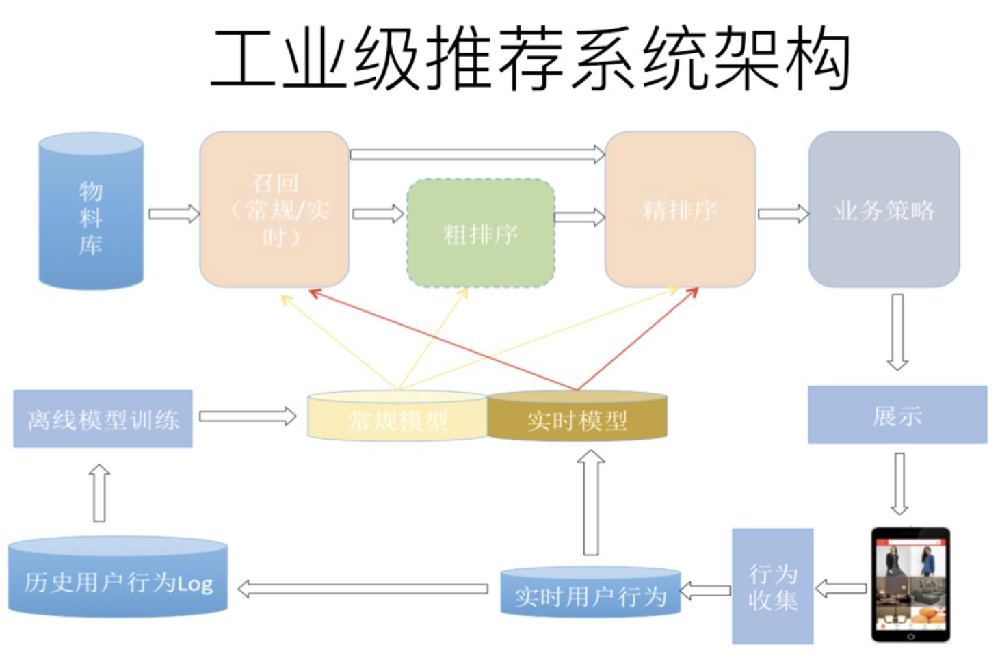
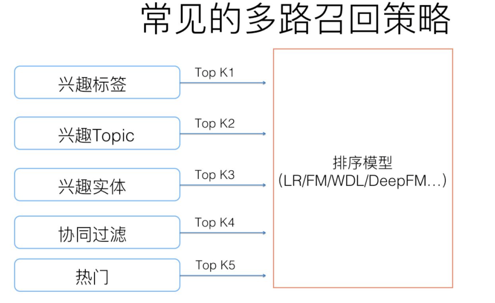

[TOC]

# 推荐系统大致

## 前言

这篇文章想从宏观的角度，介绍推荐系统。

## 典型推荐系统架构

典型的推荐系统架构如上图，一般可以分为在线部分、近线部分、离线部分。

- 在线部分：召回、精排、业务策略
- 近线部分：实时收集用户行为反馈，选择训练实例，实时训练更新在线模型（体现用户兴趣）
- 离线部分：对线上用户点击记录进行存储和清理，并周期性的更新训练模型

### 在线部分

在线部分通常是我们关注的重点，直接影响到收入问题。在线部分通常可以分为召回和排序两个阶段。

#### 召回阶段

采用简单的模型，从海量数据中快速筛选商品到千或百级别。（对效率要求高）

确保使用少量特征，保证模型泛化能力，使得用户感兴趣商品在这阶段能够被找出来。

目前工业上一般采用多路召回策略，不同的业务召回的路数不同，但常用的召回路数基本上如下图：

#### 排序阶段

排序阶段使用较复杂的模型，细致地对候选集进行个性化推荐。

排序阶段的目标是精准，可以使用较多的特征，较复杂的模型。