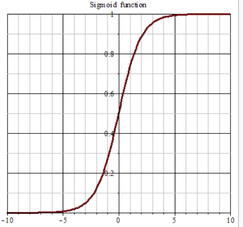
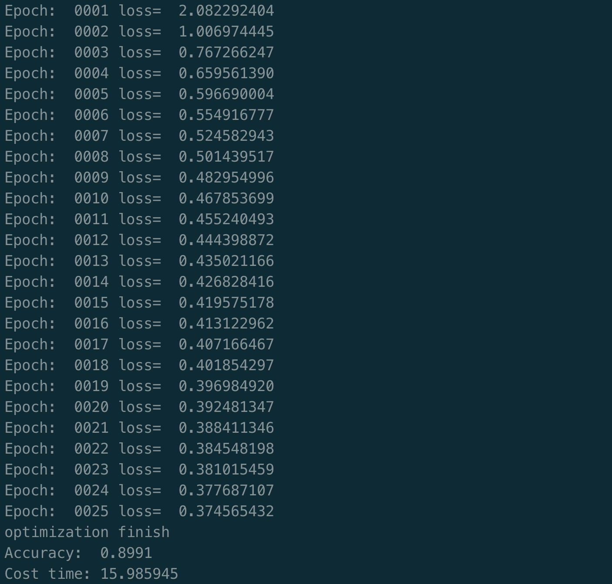

[TOC]

- [推荐系统排序算法--逻辑回归](#--------------)
  * [二元逻辑回归模型](#--------)
    + [二分类和sigmoid函数](#----sigmoid--)
    + [二元回归模型](#------)
    + [二元逻辑回归模型参数估计](#------------)
    + [二分类与多分类的关系](#----------)
    + [正则化](#---)
  * [代码实现](#----)
    + [准备数据](#----)
    + [代码思路](#----)
    + [代码结果](#----)

# 推荐系统排序算法--逻辑回归

逻辑回归（Logistic Regression LR）是一种解决二分类问题的机器学习方法，用于获取某种事物的估计值。例如用户购买某商品的概率等。因其结构简单，因此在学术界，工业界得到广泛的应用。


## 二元逻辑回归模型

### 二分类和sigmoid函数

对于二分类数据来说，可以找到一个判定边界来区分样本。其中样本在判定边界的一边，则E(X) > 0，另一边则E(X) < 0。

当样本离判定边界很远时，概率的绝对值会趋于1，当样本非常接近分界面是，概率的值则趋于0.5（第一象限内）。我们可以通过这种概率来判定样本属于某个类别。这种转换可以用sigmoid函数来实现。
$$
g(z) = \frac{1}{1 + e^{wx}}
$$


一句话总结：**对于一个输入为x的样本（一个vector），计算z = wx + b 的值，然后将z传入sigmoid函数中，计算x的score（0~1），这个score即是x样本属于正类的概率。训练逻辑回归模型的目的是，找到一组最佳的w,b参数，使得对大部分的样本都能预测正确。**

**随后计算逻辑回归模型输出结果的auc值，即取无数的score阈值，对每个阈值分别计算 真且预测为真/所有真，假且预测为真/所有假的值，计算曲线下的面积，即AUC值。**


### 二元回归模型

下面提供另一种角度的解释，为什么逻辑回归函数可以表示样本类别的概率。

二元逻辑回归的概率函数如下：

正样本：
$$
p(y=1|x) = \frac{e^{wx}}{1 + e^{wx}}
$$
负样本：
$$
p(y = 0|x) = 1 - p(y = 1|x) = \frac{1}{1 + e^{wx}}
$$
一个事件的发生比为：
$$
odds(p) = \frac{p}{1-p} = e^{wx}
$$
即发生的概率比上不发生的概率。对odds取对数得到:
$$
log(odds(p)) = wx 
$$
**当一件事情的发生比越大的时候，p的概率越大。发生比与wx成正比。所以当wx趋向于无穷的时候，p的概率将趋向于1。上述的关系正是我们想要的。因此我们可以根据这种关系，通过线性函数wx的取值来确定p的概率取值。（通过媒介sigmoid）**


### 二元逻辑回归模型参数估计

现在问题来了，我们可以通过sigmoid函数得到样本的概率，且参数确定为w，b。那么我们要怎么使得参数最好的反应样本呢，结论呼之欲出：**极大似然法**。

下面进行理论的证明：

假设有n个相互独立的样本，一个事件y发生的概率为：$p(y) = p^y(1-p)^{1-y}$，这个事件服从二项分布。因此n个样本出现的概率为：
$$
L(\theta) = \prod_{i=1}^{m}f(x;w) = \prod_{i=1}^{m} (\pi(x))^y (1 - \pi(x))^{1-y}
$$
对这一目标取对数，简化后得到:
$$
L(\theta) = \sum y(wx) - \sum log(1 + e^{wx})
$$
通过训练w，最大化这个概率，即达到学习的目的。

为了计算方便，我们通过取负数的方式（等效于交叉熵），通过梯度下降极小化这个值，最终得到w参数，使得模型AUC值最佳。


### 二分类与多分类的关系

此外二元逻辑回归可以很容易的推广到多元，通过softmax对logit函数进行取值：
$$
p(y=y_i|x) = \frac{e^{w_jx}}{\sum^{k}_{i=1}e^{w_ix}} = \frac{e^{w_jx}}{1 + \sum^{k-1}_{i=1}e^{w_ix}}
$$
第二个等式成立是因为参数存在冗余（详见《推荐系统算法实践89》），第三个式子即是我们熟悉的sigmoid形式的式子了，当k=2时即是二元回归模型了。

**一句话总结：二分类是将wx传入sigmoid函数中，多分类将wx传入softmax函数中。两者在逻辑上是相同的。**

### 正则化

对于逻辑回归的损失函数构造成的模型，有些权重可能过大或过小，容易引起过拟合。解决方法是：

1. 减少特征的数量
2. 对所有特征进行正则化

损失函数通常选用L1或者L2加上正则项如下：
$$
J(\theta) = \frac{1}{2m} \sum_{i=1}^{m}(h_\theta(x_i) - y_i)^2 + \lambda \sum\theta^2_j
$$

## 代码实现

### 准备数据

数据采用手写数据集mnist，算法的目的是对图像进行10分类。下载数据可以通过tensorflow.mnist库进行下载。

### 代码思路

使用tf.flags.FALGS记录作为网络以及训练过程的参数设置。

代码实现过程中定义W，b参数，然后将参数传入tf.nn.softmax中，得到网络的输出。

算是函数使用交叉熵函数，优化器使用随机梯度下降。

代码执行：

```
python train_main.py LR
```


### 代码结果



