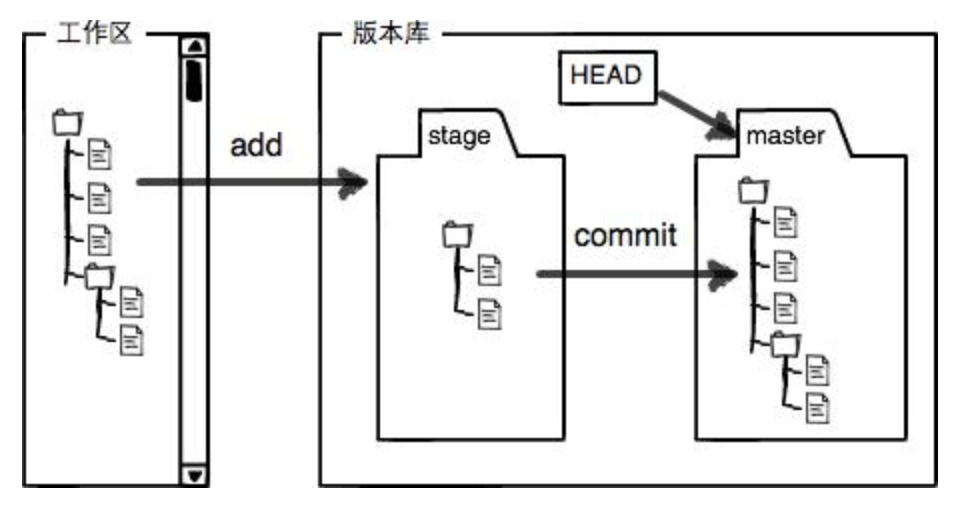

[TOC]

# github 指令介绍

## git的原理

Git的核心是对象数据库，其中三类核心的对象为：

- **blob对象：**实现对文件内容的记录；对象保存在.git/objects； 

- **tree对象：**实现对文件名，文件结构的记录以及变更过程；对象保存在暂存区.git/index文件中

- **commit对象：**实现对版本提交时间，作者信息，版本说明的记录；

  

## github 提交代码

### 上传代码的三个步骤

```git
git add filename
git commit -m 'detail'
git push
```

### github的分区管理与代码上传

git以分区的形式管理文件，主要是两大分区：

**工作区：**即当前的工作路径，保存着自己写的代码

**版本库：**在当前工作区下有一个隐藏的文件夹.git，这边是git的版本库，实现版本的管理。

版本库中存了很多东西，其中最重要的是stage（index暂存区），还有git为我们自动生成的第一个分支master，以及指向当前分支的HEAD指针。

工作区与版本库之间的关系如下图：



因此代码提交的步骤可以看成：

1. git add filename： 将文件从工作区提交到暂存区(index)中
2. git commit -m "note" ： 将文件从暂存区提交到当前head指向的分支上
3. git push将当前分支提交到服务器上


### 查看代码状态 git status

git status可以查看：

1. 当前工作区文件是否被追踪，是否存在文件修改没有提交到暂存区上。

2. 暂存区文件是否与当前分支文件内容不一样，是否存在需要commit的文件
3. 提示你本分支的文件与服务器是否不同，如果不同的话，提示你push到服务器上

## 版本控制

### 查看历史记录

```git 
git log
```

###git 版本回退

```
git reset --hard HEAD~1 # 回退到上一个版本
git reset --hard HEAD~2 # 回退到倒数第二个版本
```


